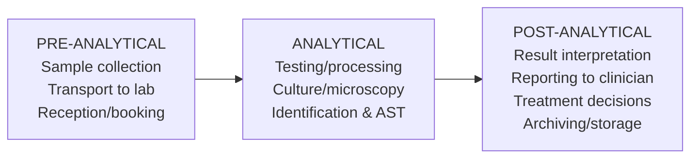
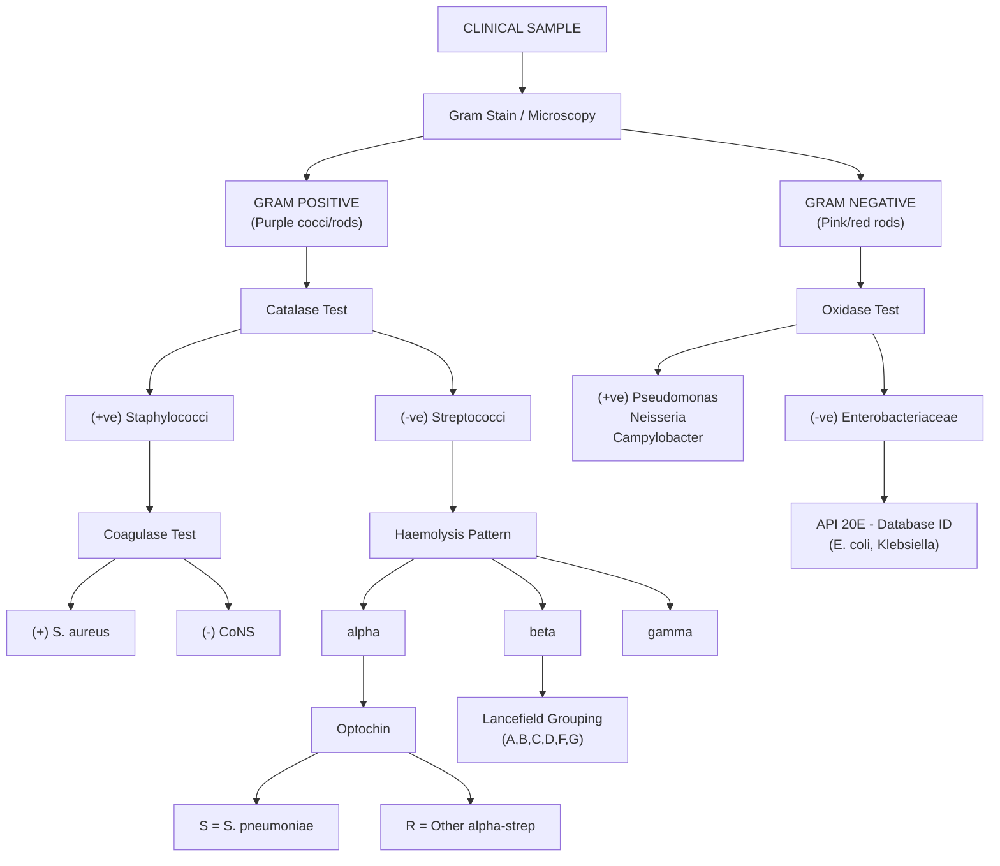
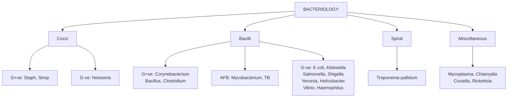

# Lecture 1: Introduction to BIOM3703 Infection

## Table of Contents
1. [Learning Outcomes](#1-learning-outcomes)
2. [Module Overview](#2-module-overview)
3. [Assessment Structure](#3-assessment-structure)
4. [Curriculum Emphasis](#4-curriculum-emphasis)
5. [Quality Assurance: UKNEQAS and UKAS](#5-quality-assurance-ukneqas-and-ukas)
6. [Clinical Sample Processing](#6-clinical-sample-processing)
7. [Urinary Tract Infections (UTIs)](#7-urinary-tract-infections-utis)
8. [Asymptomatic Bacteriuria (ABU)](#8-asymptomatic-bacteriuria-abu)
9. [Gram Stain and Confirmatory Tests](#9-gram-stain-and-confirmatory-tests)
10. [Other Clinical Samples Overview](#10-other-clinical-samples-overview)
11. [Usefulness of Gram Stain in Wound Swabs](#11-usefulness-of-gram-stain-in-wound-swabs)
12. [Revision Strategy](#12-revision-strategy)
13. [Self-Directed Learning Questions](#13-self-directed-learning-questions)
14. [Key Resources](#14-key-resources)

---

## 1. Learning Outcomes

By the end of this lecture, you should be able to:

- Understand the Infection curriculum content, learning/teaching strategies, and revision approaches
- Understand assessment requirements (coursework and exam)
- **Compare and contrast the roles of UKNEQAS and UKAS** in a clinical laboratory
- Understand the importance of clinical sample processing (variety of sample types and expected pathogens) and the importance of **sample quality** in providing a validated result
- Comment on how a **urinary tract infection (UTI)** is diagnosed in community practice (GP) versus tertiary healthcare (hospital)

---

## 2. Module Overview

### Module Team
| Staff Member | Role |
|---|---|
| Ms Marilena Ioannou | Infection Co-Module Lead |
| Dr Abu-Bakr Abu-Median | Lecturer |
| Dr Alfred Kamuyango | Lecturer |
| Dr Jessica Locker | Lecturer |
| Dr Mohamed Fadel | Lecturer |
| Dr Shivanthi Samarasinghe | Lecturer |

### Teaching and Learning Strategy
- **Delivery**: Lectures, Seminars, Virtual Microbiological Laboratory Skills
- **Self-Directed Learning (SDL)**: Available on Learning Zone; practice MCQs at end of lecture slides (in blue font)
- **Mock exam LAQs**: Provided on topics of study to aid exam preparation
- **Practicals**: 2 sessions delivered in week commencing 16 Feb 2026

### Recommended Resources
- Module Handbook / Learning Zone VLE
- **SMIs** - UK Health Security Agency (UKHSA), now Royal College of Pathologists (RCPath)
- European Communicable Disease Centre (ECDC)
- World Health Organisation (WHO)
- Communicable Disease Centre (CDC)

---

## 3. Assessment Structure

### Coursework Summative Assessment (30%)

| Component | Details |
|---|---|
| **Formative MCQ** | 10 MCQs at beginning of Infection Practical 2 (based on Infection content) |
| **Summative MCQ** | 12 March 2026, 10am on campus. 30 MCQs based on ALL Infection AND Immunity content |

### Exam Summative Assessment (70%) - 3 hours

| Section | Weight | Format |
|---|---|---|
| **Section A** | 20% | 20 MCQs (Infection AND Immunity) |
| **Section B** | 40% | Choose 1 Infection LAQ (out of 2 options) |
| **Section C** | 40% | Choose 1 Immunity LAQ (out of 2 options) |

> **Important**: Use a **separate exam booklet** for each LAQ answered.
> **Exam date**: Wednesday 25 March 2026, 10am

---

## 4. Curriculum Emphasis

The BIOM3703 Infection module covers the following core themes:

### 4.1 Pathogens and Diseases
- Bacteria, fungi, viruses, and parasites as disease-causing agents
- **Names of microbes** are important to learn
- Some pathogens cause **more than one type of disease**
  - Example: *Streptococcus pyogenes* (Beta Haemolytic Group A Streptococcus / GAS) can cause:
    - **Pharyngitis/tonsillitis** (sore throat)
    - **Scarlet fever** (diffuse erythematous rash, "sandpaper" texture, strawberry tongue)
    - **Necrotising fasciitis** (aggressive, life-threatening deep tissue destruction - "flesh-eating disease")
    - Impetigo, cellulitis, puerperal sepsis, rheumatic fever, post-streptococcal glomerulonephritis
  - Example: *E. coli* causes UTIs, neonatal meningitis, gastroenteritis (ETEC, EHEC O157), septicaemia
  - Example: *Haemophilus influenzae* causes meningitis, pneumonia, epiglottitis, otitis media

### 4.2 Microbial Detection and Identification
Three main approaches in clinical laboratories:
1. **Phenotypic methods** - Gram stain, culture, biochemical tests (catalase, coagulase, oxidase, API strips)
2. **Automated methods** - MALDI-TOF MS, VITEK2, Phoenix
3. **Molecular methods** - PCR, whole genome sequencing (WGS), NAAT

### 4.3 Other Key Topics
- **Infection control, treatment** (antimicrobials), **prevention/control** (vaccination, quarantine)
- **Surveillance and epidemiology** - modelling outbreaks, epidemics, pandemics
- **Food, Water and Environmental monitoring**
- **Healthcare-Associated Infections (HAIs)**: *C. difficile*, MRSA, *E. coli*, *Klebsiella* spp, *P. aeruginosa*
- **Community-acquired infections**
- **Antimicrobial resistance** and its laboratory detection
- **Emerging infectious diseases**
- **Parasitology / Medical Mycology / STDs**

### 4.4 Key Revision Concepts
For each pathogen studied, you need to know:

| Theme | Key Question |
|---|---|
| **Disease & Pathogen** | What disease(s) does it cause? What are its morphology and virulence factors? |
| **Diagnosis / Lab Detection** | How is it identified? (culture characteristics, biochemical tests, molecular) |
| **Epidemiology** | Who is affected? How many? Where? Give an example of an outbreak |
| **Transmission** | Aerosol, faecal-oral, sexually transmitted, direct contact, vector-borne? |
| **Treatment** | Antibiotic or antiviral available? Is there prophylaxis? |
| **Prevention / Surveillance** | Vaccine available? Education/awareness? Surveillance in UK/globally? |

---

## 5. Quality Assurance: UKNEQAS and UKAS

> **Critical exam topic**: Be able to compare and contrast these two organisations.

### 5.1 UKNEQAS - United Kingdom National External Quality Assessment Scheme

**Purpose**: External quality assessment (proficiency testing) for clinical laboratories.

**Key facts**:
- Simulated samples are sent to all UK clinical laboratories (UKAS accredited) to **test their performance** in correctly identifying/quantifying pathogens within a designated timeframe
- Participation is **voluntary and confidential** - open to public, private, pharmaceutical, and veterinary laboratories worldwide
- Laboratories are identified by an **anonymised code**
- UKNEQAS **publishes correct results** and benchmarks laboratory performance nationally
- Provides a **schedule for proficiency testing** dependent on diagnostic tests offered

**Areas covered by UKNEQAS for Microbiology**:
1. **General bacteriology** (Urine, Sputum, Swabs, Faeces etc.)
2. **Virology**
3. **Serological testing**
4. **Blood donor testing** (blood-borne viruses and syphilis)
5. **Parasitology**
6. **Antimicrobial Susceptibility Testing** (labs receive bacterial isolates for AST)
7. **Molecular Methods Testing**

**International reach**: UKNEQAS operates across numerous European and non-European countries including the UK, Germany, France, Australia, USA, India, Nigeria, South Africa, and many more.

### 5.2 UKAS - United Kingdom Accreditation Service

**Purpose**: Accreditation body that ensures clinical laboratories meet quality standards.

**Key facts**:
- UKAS is a **different organisation** from UKNEQAS with a **different role**
- Previously, Food/Water/Environmental testing labs (UKAS accredited) had **stricter standards** than clinical labs (Clinical Pathology Accreditation / CPA)
- In **2009**, CPA became a subsidiary of UKAS to modernise pathology services
- UKAS managed the **transition of all CPA labs** to the internationally recognised standard **ISO 15189:2012**
- Provides a better **evidenced audit trail** from sample collection to result reporting
- **Mandatory**: Any clinical laboratory testing human/animal samples where results impact treatment **must be UKAS accredited**

### 5.3 UKNEQAS vs UKAS Comparison

| Feature | UKNEQAS | UKAS |
|---|---|---|
| **Full name** | UK National External Quality Assessment Scheme | UK Accreditation Service |
| **Role** | External quality assessment / proficiency testing | Laboratory accreditation |
| **How it works** | Sends simulated samples to labs; compares results | Inspects/audits labs against ISO 15189 standards |
| **Participation** | Voluntary, confidential | Mandatory for clinical labs |
| **Focus** | Tests whether lab can correctly identify pathogens | Ensures lab processes, equipment, staff meet standards |
| **Outcome** | Performance report comparing lab to national peers | Accreditation certificate (or withdrawal) |
| **Analogy** | Like a "mock exam" for the lab | Like an "Ofsted inspection" for the lab |

### 5.4 Patient Sample Journey - The Three Stages

> **Key principle**: "Rubbish sample in = Rubbish test result out"

---

## 6. Clinical Sample Processing

### 6.1 Types of Samples Received in Medical Microbiology

| Sample Type | Collection Method / Notes |
|---|---|
| **Urine** | MSU (mid-stream urine), CSU (catheter specimen), SPA (suprapubic aspirate) |
| **Blood** | Blood cultures (aerobic + anaerobic bottles) |
| **Swabs** | From any infection site: nasal, eye, ear, throat, skin/wound, endocervical/HVS, urethral, rectal |
| **Sputum** | Also BAL (bronchoalveolar lavage), endotracheal aspirate, nasopharyngeal aspirate |
| **Faeces** | Stool samples |
| **Food, Water, Environmental** | Environmental monitoring samples |
| **Other** | CSF, tissue biopsies, joint fluids (knee aspirates), ascites fluid, pleural effusion, CAPD fluid |

### 6.2 Pre-Analytical Stage - Why It Matters

The pre-analytical stage is **one of the most important stages** in patient sample processing. Factors that can compromise sample quality:

- **Sample integrity** - has it leaked from the container?
- **Temperature conditions** - at collection, during storage, and in transit (ideally 4°C)
- **Transit time** - ideally tested same day
- **Collection technique** - trained healthcare professional vs. patient self-collection introduces variability

> **COVID Test & Trace example**: The T&T system failed partly because it was outsourced (NHS/PHE to SERCO), and sample quality/handling was compromised at multiple levels.

### 6.3 Sample Container Requirements

All clinical sample containers should be:
- **Leakproof** - universal container
- **Sterile** - to prevent contamination introducing false-positive results
- **CE marked** - indicates conformity with EU/UK health, safety, and environmental standards (quality-assured medical device)
- **Correctly labelled** with patient details: name, DOB, hospital number, sample type, date/time taken, origin (GP/ward)
- Transported in **clear plastic leakproof bag** with Pathology Request Form or barcode

---

## 7. Urinary Tract Infections (UTIs)

### 7.1 Common Causative Organisms

> A **pure or predominantly heavy growth** of a urinary pathogen on primary agar is considered significant.

#### Gram-Negative Bacteria (Enterobacteriaceae / Enterobacterales)
| Organism | Key Notes |
|---|---|
| ***E. coli*** | **Most common cause of UTIs (>70%)**. Gram-negative rod. Lactose fermenter |
| *Pseudomonas aeruginosa* | Non-fermenter. Oxidase positive. Often nosocomial |
| *Klebsiella pneumoniae* | Mucoid colonies. Capsulated. Lactose fermenter |
| *Proteus mirabilis* | Swarming motility. Urease positive. Alkaline urine. Associated with renal stones |
| *Enterobacter* spp | Opportunistic. AmpC beta-lactamase producer |

#### Gram-Positive Bacteria
| Organism | Key Notes |
|---|---|
| *Staphylococcus aureus* | Coagulase positive. Can cause haematogenous seeding to kidney |
| *Staphylococcus saprophyticus* | Common in young sexually active women. Novobiocin resistant |
| **Beta-haemolytic streptococci** | Groups A, B, C, D, F, G |
| *Streptococcus pneumoniae* | Alpha-haemolytic. Rare UTI cause |
| *Enterococcus faecalis* | Non-haemolytic (gamma). Common in catheter-associated UTIs |

#### Other Organisms
| Type | Organisms |
|---|---|
| **Fastidious** | *Neisseria gonorrhoeae*, *Legionella pneumophila* (rare UTI causes) |
| **Yeasts** | *Candida* spp, especially *Candida albicans* |
| **Parasites** | *Enterobius vermicularis* (pinworm), *Schistosoma* spp |

### 7.2 Urine Sample Quality

#### Container Requirements for Urine
- Leakproof, sterile, CE marked universal container
- Contains **boric acid** as a preservative
  - **Why boric acid?** It acts as a bacteriostatic agent that **prevents bacterial multiplication** during transport, maintaining the original colony count
  - **Under-filling**: Too concentrated boric acid → **bactericidal** (kills organisms) → false negative
  - **Over-filling**: Diluted boric acid → **ineffective preservation** → bacterial overgrowth → false positive/elevated counts
- Has a **graduated fill line** to ensure correct boric acid concentration

### 7.3 Diagnosing UTIs

#### Community Practice (GP) - POCT Dipstick
- **Point-of-Care Testing (POCT)** using urine dipstick
- Tests for:
  - **Nitrites** - positive suggests Gram-negative bacteria (Enterobacteriaceae convert dietary nitrates to nitrites)
  - **Leucocyte esterase** - positive suggests WBCs/inflammation (pyuria)
  - Also: blood, protein, pH, glucose
- Dipstick is a **screening tool** to rule out negatives; positive results may warrant culture

#### Hospital Laboratory - Full Workup
1. **Pre-screening by flow cytometry** (e.g., Sysmex UF1000i, UriF100, SediMAX)
   - Automated counting of WBCs, RBCs, bacteria, epithelial cells, casts
   - Screens out negative samples, reducing unnecessary cultures
2. **Inverted microscopy** on microtitre trays - counting WBC/leucocytes, RBC, epithelial cells
3. **Culture on CLED agar** (Cysteine Lactose Electrolyte Deficient Agar)
   - Incubation: **24 hours, aerobic (O2), 37°C**
   - CLED is **electrolyte-deficient** which prevents swarming of *Proteus* spp
   - Lactose fermenters produce yellow colonies; non-fermenters produce blue/green colonies

#### Interpreting Growth on Agar
Three things to assess:

**1. Quantity of growth:**
| Code | Meaning |
|---|---|
| + | Scanty growth |
| ++ | Moderate growth |
| +++ | Heavy growth |

**2. Purity of growth:**
- **Pure growth** - single organism type
- **Predominant growth** - one organism type predominates
- **Mixed growth** - more than one organism type (suggests contamination unless from catheter/SPA)

**3. Significance:**
- Identify any significant pathogen(s) using coding above
- Example: "+++ *Pseudomonas aeruginosa*" = Heavy pure growth of a significant urinary pathogen

> **Note**: Gram stain is **NOT routinely used on MSU samples**. It IS used on:
> - **Suprapubic aspirates (SPA)** - especially from children/neonates
> - Any **microbial isolate growing on agar** to help determine identification

---

## 8. Asymptomatic Bacteriuria (ABU)

*Based on the provided paper: Mandal J. "Significance of Asymptomatic Bacteriuria." EMJ 2017.*

### 8.1 Definition
ABU is the isolation of bacteria in **significant counts (>10^5 CFU/mL)** of a single bacterial species from a clean-catch urine specimen in an individual with **no acute signs or symptoms** of UTI.

### 8.2 Key Points

- **Very common**: 1-5% of premenopausal women; increases with age
- Sexually active women have **5x higher prevalence** than non-sexually active
- **Uncommon in young men** - if present, investigate for prostatitis
- In pregnancy: prevalence 2-15%. If untreated, **20-30% may develop acute pyelonephritis**
- Most common organism: ***E. coli*** (80-90%), followed by *Enterococcus*, *Klebsiella*, *Proteus*

### 8.3 When to Screen and Treat

| **SCREEN AND TREAT** | **DO NOT SCREEN / DO NOT TREAT** |
|---|---|
| Pregnant women (risk of pyelonephritis, preterm labour) | Diabetic women |
| Prior to urological surgery (mucosal bleed risk) | Elderly males or females |
| | Spinal cord injury patients |
| | Catheterised individuals |
| | Patients with neobladder / ileal conduit |

### 8.4 Why NOT to Treat ABU (in most cases)
- Treatment **does not reduce** frequency of symptomatic UTI
- Leads to **antibiotic resistance** through unnecessary exposure
- Causes **collateral damage**: alteration of gut flora, increased *C. difficile* risk
- Destroying harmless colonising strains may paradoxically **increase risk of UTI** by removing "bacterial interference" - less virulent strains protecting against more virulent ones

### 8.5 Pregnancy-Specific Considerations
- Enlarged uterus compresses bladder → urinary stasis
- Progesterone relaxes smooth muscle → dilates ureters → reflux → pyelonephritis risk
- Glycosuria (gestational diabetes) and proteinuria (pregnancy-induced hypertension) promote bacterial growth
- *Streptococcus agalactiae* (Group B Strep) in urine of pregnant women **must be treated** - risk to baby during vaginal delivery

### 8.6 The Edward Kass Criteria
- **10^5 CFU/mL** threshold was established by Edward Kass in the 1950s
- Originally used to distinguish true pathogens from contamination
- Later studies showed counts **below 10^5** can also represent true UTI
- For catheterised urine, threshold may be as low as **10^3 CFU/mL**

---

## 9. Gram Stain and Confirmatory Tests

### 9.1 Gram Stain - The Most Important Stain in Clinical Microbiology

**Principle**: Differentiates bacteria based on cell wall structure.

**Protocol**:
1. Label microscope slide
2. Emulsify microbe in drop of diluent on slide surface
3. **Air dry completely** before heat fixing (*Why? Prevents washing off bacteria during staining*)
4. **Crystal Violet** - 1 minute (primary stain)
5. Wash with tap water
6. **Iodine (Lugol's)** - 1 minute (mordant - fixes crystal violet)
7. Wash with tap water
8. **95% Alcohol** - 10 seconds MAX (decolouriser - critical step)
9. Wash with tap water
10. **Safranin** - 1 minute (counterstain)
11. Wash with tap water

**Viewing**: Blot dry → add immersion oil → view on low power (x10) first → switch to oil immersion (x100)

> **Always include QC**: Known Gram-positive and known Gram-negative controls with each staining run.

**Interpretation**:
| Result | Appearance | Cell Wall |
|---|---|---|
| **Gram-positive** | Purple/violet | Thick peptidoglycan layer retains crystal violet-iodine complex |
| **Gram-negative** | Pink/red | Thin peptidoglycan + outer membrane; alcohol dissolves outer membrane, CV-I complex washes out |

### 9.2 Confirmatory Tests Summary

| Test | Purpose | Key Details |
|---|---|---|
| **Catalase test** | Differentiates *Staphylococcus* (positive) from *Streptococcus* (negative) | Add H2O2 to colony. Bubbles = catalase positive (enzyme breaks down H2O2 → H2O + O2) |
| **Coagulase test** | Differentiates staphylococci | *S. aureus* = coagulase positive (clumps rabbit plasma). CoNS = negative. Tube test is gold standard |
| **Oxidase test** | Identifies oxidase-positive organisms | *Pseudomonas*, *Neisseria*, *Campylobacter* are all oxidase positive. Uses TMPD or DPD reagent |
| **Streptococcal grouping** | Differentiates beta-haemolytic streptococci | Lancefield groups A, B, C, D, F, G using latex agglutination (Streptex kit) |
| **API 20E** | Identifies Enterobacteriaceae (Gram-negative rods) | 20 biochemical reactions; read after 24hr aerobic incubation at 37°C; generate analytical profile number for database ID |

### 9.3 Identification Flowchart

---

## 10. Other Clinical Samples Overview

### 10.1 Skin/Wound Swab Processing

**Clinical details are crucial** because they determine which organisms to look for:
- **Diabetic/immunosuppressed** → consider fungi (*Candida*)
- **Burns/trauma** → *Candida* spp, *P. aeruginosa*, *S. aureus*, *S. pyogenes*
- **Deep-seated wounds** → anaerobic bacteria (*Bacteroides*, *Prevotella*, *Clostridium*)

**Processing method**:
1. Inoculate agar with swab: Blood Agar (CO2) → Blood Agar (anaerobic) → MacConkey agar
2. Streak for single colonies across whole plate
3. Incubate: O2/anaerobic, 48 hours, 37°C
4. Interpret: quantity (heavy/moderate/scanty), purity (pure/predominant/mixed)
5. Confirmatory tests starting with Gram stain

**Common wound pathogens (burns)**:
- *Pseudomonas* spp
- "Coliforms" (e.g. *E. coli*)
- *Staphylococcus aureus*
- *Streptococcus pyogenes* (Group A Streptococcus)
- *Candida albicans* (fungi)

### 10.2 Sputum - Respiratory Tract Infections

**Common respiratory pathogens and incubation conditions**:

| Organism | Incubation | Type |
|---|---|---|
| *Haemophilus influenzae* | CO2 | Gram-negative coccobacillus |
| *Streptococcus pneumoniae* | CO2 | Gram-positive diplococcus |
| *Staphylococcus aureus* | O2 | Gram-positive coccus |
| *Pseudomonas* spp | Strictly O2 | Gram-negative rod |
| *Klebsiella pneumoniae* | O2 | Gram-negative rod |
| *Mycobacterium tuberculosis* | O2 | Acid-fast bacillus |
| *Bordetella pertussis* | O2/humidity | Gram-negative coccobacillus |
| *Legionella pneumophila* | O2/humidity | Gram-negative rod |
| Influenza virus, RSV, Rhinovirus, SARS-CoV-2 | - | Viruses |
| *Aspergillus niger*, *Pneumocystis carinii* | - | Fungi |
| *Paragonimus westermanii* | - | Lung fluke (parasite) |

**Sputum collection instructions for patients**:
- No food for 1-2 hours prior to expectoration
- Rinse mouth with saline or water
- Breathe deeply, cough, and expectorate into sterile CE-marked container
- Send to lab immediately; process ASAP

**Processing**:
- Sputum treated with **Sputasol (dithiothreitol)** to liquefy mucus before inoculation
- Processed in **Class II Microbiological Safety Cabinet** (Category 3 Room) due to potential for *M. tuberculosis*
- **Optochin disc** placed in primary inoculum area to screen for *S. pneumoniae*
- Incubation: **5-10% CO2, 48 hours**

> **Why Class II Safety Cabinet?** Respiratory samples may contain *M. tuberculosis* (Category 3 pathogen). The cabinet protects the operator through HEPA-filtered laminar airflow - air is drawn in through the front opening, passed through a HEPA filter for recirculating air, and exhausted through another HEPA filter.

### 10.3 Faeces - Gastrointestinal Infections

**Common GI pathogens**:

| Category | Organisms |
|---|---|
| **Bacteria** | *Campylobacter jejuni*, *Salmonella enteritidis*, *Shigella sonnei*, *E. coli*, *E. coli O157* (causes HUS), *Listeria monocytogenes*, *Vibrio cholerae*, *V. parahaemolyticus*, *Yersinia enterocolitica*, *Aeromonas hydrophila*, *S. aureus*, *Bacillus cereus*, *Clostridium difficile*, *C. perfringens*, *C. botulinum* |
| **Viruses** | Enteroviruses, Rotavirus, Norovirus (Norwalk), Hepatitis |
| **Parasites** | *Cryptosporidium parvum*, *Cyclospora cayetanensis*, *Giardia lamblia*, *Entamoeba histolytica*, *Enterobius vermicularis*, plus travel-associated: *Ascaris*, *Strongyloides*, *Diphyllobothrium* |

---

## 11. Usefulness of Gram Stain in Wound Swabs

*Based on: Clark et al. "Wound swab quality grading is dependent on Gram smear screening approach." Scientific Reports (2023).*

### Key Concepts from the Paper

#### The Q Score System
A quality grading approach for wound swab Gram smears using two indicators:
- **Squamous Epithelial Cells (SECs)** - indicate contamination with skin flora (scored 0 to -3)
- **Polymorphonuclear cells (PMNs)** - indicate infection/inflammation (scored 0 to +3)

| Q Score | Quality | Interpretation |
|---|---|---|
| **Q0** | Low quality | Likely contaminated; limited clinical value |
| **Q1** | Moderate quality | Some contamination |
| **Q2** | Moderate quality | Acceptable |
| **Q3** | High quality | Good specimen with inflammation, minimal contamination |

#### Clinical Significance
- **Poor quality swabs** (high SEC, low PMN) likely reflect **skin contamination** rather than true infection
- The Q score determines how many pathogens to report with ID and AST (up to 3 from Q3 specimens, none from Q0)
- The study found only ~7% of swabs were low quality (Q0), suggesting prior education on collection improved quality
- **Important caveat**: Rejecting Q0 specimens may miss some primary pathogens (e.g. *S. aureus*) - labs should have a specimen retention policy

#### Practical Implications for Lab Scientists
- Gram stain is **not universally required** for wound swabs (PHE/UK guidance doesn't mandate it)
- However, it is increasingly recommended (Choosing Wisely Canada) as critical for swab quality assessment
- Collection method matters: **Levine technique** (rotating swab over 1cm^2 area with sufficient pressure to express fluid) is recommended
- "Rubbish sample in = Rubbish test result out" applies strongly to wound swabs

---

## 12. Revision Strategy

### Mind Map Approach
The lecturer strongly recommends **mind maps** for Infection revision rather than linear note-taking because infection topics are interconnected.

### Bacteriology Mind Map Structure

### Revision Table Template
For EACH pathogen, fill in:

| Column | Questions to Answer |
|---|---|
| Disease & Pathogen | What disease? Morphology? Virulence factors? |
| Diagnosis / Lab Detection | Microbial growth characteristics? Confirmatory tests? |
| Epidemiology | Who affected? How many? Where? Example outbreak? |
| Transmission | Aerosol? Faecal-oral? Sexual? Direct contact? |
| Treatment | Antibiotic/antiviral? Prophylaxis? |
| Prevention / Surveillance | Vaccine? Education? Surveillance (UK/global)? |

---

## 13. Self-Directed Learning Questions

Test your knowledge with these questions from the lecture:

1. **What are the three stages of clinical sample processing?** (Pre-Analytical, Analytical, Post-Analytical)

2. **What types of samples are collected for UTI investigation?** (MSU, CSU, SPA)

3. **Why is urine collected in sterile containers containing boric acid?** What are the problems of under-filling/over-filling?

4. **Give an example of selective agar used in UTI investigation** (including its constituents). *(CLED - Cysteine, Lactose, Electrolyte Deficient)*

5. **Is the Gram stain useful in the investigation of UTI?** *(Not for MSU; yes for SPA and for identifying isolates on agar)*

6. **Give an example of how automation may be used in urine processing** and explain the principle. *(Flow cytometry - Sysmex UF1000i uses laser light scattering and fluorescent staining to count and classify particles)*

7. **Compare and contrast UKNEQAS and UKAS** - their roles, how they work, and their importance in clinical diagnostics.

---

## 14. Key Resources

### Web Sources
- **CDC** (Communicable Disease Centre): http://www.cdc.gov/
- **WHO** (World Health Organisation): http://www.who.int/en/
- **ECDC** (European Centre for Disease Prevention and Control): https://www.ecdc.europa.eu/en
- **UKHSA** (UK Health Security Agency): https://www.gov.uk/topic/health-protection/infectious-diseases
- **UKNEQAS**: https://ukneqas.org.uk/
- **UKAS**: https://www.ukas.com/

### UK SMIs (Standard Methods of Investigation)
- ID-1: Preliminary Identification of Medically Important Bacteria
- B-11: Investigation of swabs from skin and superficial soft tissue infections

### Recommended Reading
- Clark ST et al. (2023) "Wound swab quality grading is dependent on Gram smear screening approach." *Scientific Reports* 13:3160
- Mandal J (2017) "Significance of Asymptomatic Bacteriuria." *European Medical Journal* 2(3):71-77

### YouTube Educators for Supplementary Learning
- **Ninja Nerd** - Excellent for UTI pathophysiology and microbiology
- **Medicosis Perfectionalis** - Detailed microbiology lectures
- **Dr. Mike** - Clinical perspectives
- **Dr. Matt** - Laboratory-focused content
