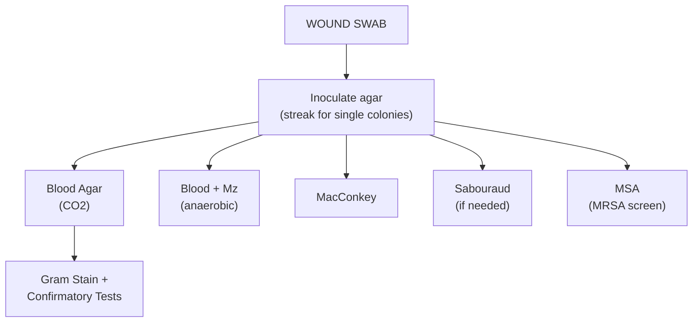

# Lecture 2: Skin and Skin-Associated Infections

## Table of Contents
1. [Learning Outcomes](#1-learning-outcomes)
2. [Skin Defences](#2-skin-defences)
3. [Predisposing Factors](#3-predisposing-factors-for-skin-infections)
4. [Clinical Presentations](#4-clinical-presentations-of-skin-infections)
5. [Skin Pathogens Overview](#5-skin-pathogens-overview)
6. [Wound Infections](#6-wound-infections)
7. [Normal Skin Flora](#7-normal-skin-flora)
8. [Virulence Factors](#8-virulence-factors)
9. [Scarlet Fever Epidemiology](#9-scarlet-fever-epidemiology)
10. [Treatment](#10-treatment-of-skin-and-wound-infections)
11. [Laboratory Detection](#11-laboratory-detection)
12. [Parasitic Skin Infections](#12-parasitic-skin-infections)
13. [SDL Questions with Answers](#13-sdl-questions-with-answers)
14. [Key Resources](#14-key-resources)

---

## 1. Learning Outcomes

- Understand skin defences and how they protect from infection
- Give examples of skin/wound pathogens, including those invading **intact skin**
- Describe virulence factors enabling skin invasion and infection
- Discuss lab detection of *S. aureus*, *S. pyogenes* (GAS), *P. aeruginosa*, *C. albicans*

---

## 2. Skin Defences

Intact skin is an **effective barrier** against most infections.

### 2.1 Structure

| Layer | Features |
|---|---|
| **Epidermis** | Thin outer epithelial layer; **Langerhans cells** (immune surveillance), dead cells, **keratin** (waterproof) |
| **Dermis** | Thick connective tissue; blood vessels, nerves, sebaceous/sweat glands |

### 2.2 Mechanical Defences

| Defence | Mechanism |
|---|---|
| **Physical barrier** | Intact epidermis prevents microbial entry |
| **Skin shedding** | Desquamation removes adherent microbes |
| **Temperature** | Skin surface (~33C) limits some pathogen growth |
| **Low humidity** | Dry skin inhibits microbial growth |

### 2.3 Chemical Defences

| Defence | Mechanism |
|---|---|
| **Sebum** | Unsaturated fatty acids from sebaceous glands inhibit pathogenic bacteria/fungi |
| **pH** | Low pH (**3-5**) from lactic acid and fatty acids ("acid mantle") inhibits colonisation |
| **Perspiration** | Contains **lysozyme** and acids |
| **Lysozyme** | Cleaves peptidoglycan in **Gram-positive cell walls**; found in nasal secretions, saliva, tears |

### 2.4 Exceptions: Pathogens Penetrating Intact Skin

| Category | Pathogen | Notes |
|---|---|---|
| **Parasites** | *Dracunculus medinensis* | Guinea worm; migrates to skin after copepod ingestion |
| | Hookworms (*Ancylostoma*, *Necator*) | Larvae penetrate feet from soil |
| | *Schistosoma* spp | Cercariae penetrate during water contact |
| | *Wuchereria bancrofti* | Via mosquito vector |
| **Spirochaetes** | *Leptospira interrogans* | Via intact skin from contaminated water (Weil disease) |
| | *Borrelia burgdorferi* | Via tick bite (Lyme disease) |
| **Fungi** | *Trichophyton*, *Microsporum*, *Epidermophyton* | Keratinophilic; invade skin, hair, nails |

---

## 3. Predisposing Factors for Skin Infections

- Severe **atopic dermatitis** / eczema
- Poorly controlled **diabetes mellitus**
- **Kidney failure** / dialysis
- **Blood disorders**: leukaemia, lymphoma
- **Low serum iron**, **malnutrition**
- **IVDA** (intravenous drug abuse)
- **Systemic steroids**, retinoids, cytotoxics, immunosuppressives
- **Alcoholism**, cardiovascular disease, psoriasis, trauma

---

## 4. Clinical Presentations of Skin Infections

| Condition | Pathogen | Features |
|---|---|---|
| **Impetigo** | *S. aureus* / *S. pyogenes* | Honey-crusted lesions; highly contagious; children |
| **Cellulitis** | *S. pyogenes* (main) / *S. aureus* | Spreading erythema, warmth, swelling; poorly demarcated |
| **Erysipelas** | *S. pyogenes* | Sharply demarcated raised red area; face/legs; involves upper dermis |
| **Necrotising fasciitis** | *S. pyogenes* (Type II) | Rapidly progressive; severe pain out of proportion to appearance; surgical emergency |
| **Folliculitis** | *S. aureus* | Infected hair follicles; papules/pustules |
| **Furuncle/Carbuncle** | *S. aureus* | Deep follicular abscess; carbuncle = coalesced furuncles |
| **SSSS** | *S. aureus* (exfoliatin) | Scalded skin syndrome; neonates/young children; widespread blistering |
| **Wound infection** | Polymicrobial | Failure to heal; erythema, exudate, pain |

---

## 5. Skin Pathogens Overview

| Category | Pathogens |
|---|---|
| **Bacteria** | *S. aureus*, BHS (*S. pyogenes* GAS), *Leptospira interrogans*, *M. leprae* |
| **Parasites** | *Dracunculus medinensis*, *Schistosoma* spp, hookworms |
| **Viruses** | Varicella zoster (chickenpox/shingles) |
| **Fungi** | Dermatophytes, *Candida albicans* |

---

## 5. Wound Infections

### 5.1 Definitions

| Term | Definition |
|---|---|
| **Contamination** | **Non-replicating** organisms present |
| **Colonisation** | **Replicating** organisms **without host injury** |
| **Infection** | **Replicating** organisms **causing host injury** |

### 5.2 Signs of Infection

- **Failure to heal** + progressive deterioration (key feature)
- Increased exudate, swelling, erythema, pain, local temperature
- Periwound cellulitis, ascending infection
- Granulation tissue changes (discoloration, friable, bleeds)

> Poor healing also from diabetes, cardiovascular problems -- not just infection.
> Treatment modalities: **honey**, **maggots** (larval debridement), surgical **debridement**

### 5.3 Wound Flora Timeline

| Stage | Timeframe | Organisms |
|---|---|---|
| **Early acute** | Days | Normal flora, then *S. aureus* + BHS (GBS + *S. aureus* in diabetic foot ulcers) |
| **Intermediate** | ~4 weeks | Facultative anaerobic GN rods: *Proteus*, *E. coli*, *Klebsiella* |
| **Deterioration** | Weeks-months | Anaerobes: *Clostridium*, *Prevotella*. Polymicrobial (4-5 organisms) |
| **Chronic** | Long-term | More anaerobes than aerobes. Exogenous GNR: *Pseudomonas*, *Acinetobacter*, *Stenotrophomonas* |
| **Deep/Osteomyelitis** | Late | *S. aureus*, coliforms, anaerobes. Tx: antibiotics + debridement + hyperbaric O2 |

### 5.4 Burns Infections

*Pseudomonas aeruginosa* (GN rod), *S. aureus* (GP coccus), *S. pyogenes* (GP coccus), *Candida albicans* (yeast)

---

## 6. Normal Skin Flora

*S. epidermidis*, *Micrococcus*, *Corynebacterium*, *Propionibacterium*, *Acinetobacter*

| Feature | Resident Flora | Transient Flora |
|---|---|---|
| **Definition** | Permanent skin inhabitants | Deposited via contact/aerosol |
| **Removal** | Difficult (why surgeons wear gloves) | Easy with handwashing |
| **Examples** | *S. epidermidis*, *Corynebacterium* | *Pseudomonas*, *E. coli*, *Salmonella*, Norovirus |
| **Role** | "Bacterial interference" protects against pathogens | Include pathogens |

---

## 7. Virulence Factors

### 7.1 *Staphylococcus aureus*

| Category | Factor | Function |
|---|---|---|
| Colonisation | Protein **adhesins** | Host cell attachment |
| Invasion | **Staphylokinase**, proteases, lipases, **collagenase**, **elastase** | Tissue breakdown |
| Anti-phagocytic | **Coagulase** | Fibrin cloak protects from phagocytes |
| | **Leukocidin** (PVL) | Kills WBCs |
| Toxin | **Exfoliatin** | **Scalded Skin Syndrome** -- epidermal separation |

### 7.2 *Streptococcus pyogenes* (GAS)

5-15% of normal individuals harbour it asymptomatically in the respiratory tract.

| Category | Factor | Function |
|---|---|---|
| Anti-phagocytic | **M protein** | Major virulence determinant; inhibits phagocytosis |
| | **Hyaluronic acid capsule** | "Immunological disguise"; anti-phagocytic |
| Adherence | **Protein F** (fibronectin-binding) + **Lipoteichoic acid** | Host attachment |
| Invasion | **Streptokinase** | Dissolves clots |
| | **Hyaluronidase** | Breaks down connective tissue -- **key in necrotising fasciitis** |
| | **Streptolysins** O and S | Lyse RBCs/WBCs; beta-haemolysis |
| Exotoxin | **Pyrogenic toxin** | **Scarlet fever** rash; **toxic shock syndrome** |

### 7.3 Lancefield Grouping (BHS)

| Group | Species | Significance |
|---|---|---|
| **A** | *S. pyogenes* | Pharyngitis, scarlet fever, NF, impetigo, cellulitis |
| **B** | *S. agalactiae* | Pregnancy complications; **1 in 5** pregnant women carry GBS |
| C | Various | Occasional infections |
| D | *Enterococcus* spp | UTIs, endocarditis |
| F | *S. anginosus* group | Abscesses |
| G | Various | Pharyngitis, skin infections |

---

## 8. Scarlet Fever Epidemiology

- Historically common cause of childhood death
- **Lamagni et al. (2018)**: large increase 2014 -- highest in 50 years (England)
- 2015: Leicestershire and Cumbria highest incidence
- Clinical: "sandpaper" rash, **strawberry tongue**, circumoral pallor

---

## 9. Treatment of Skin and Wound Infections

| Infection | Treatment |
|---|---|
| MSSA | **Flucloxacillin** |
| MRSA | **Vancomycin** |
| Topical staph | **Mupirocin** cream |
| GAS | **Penicillin** or **Erythromycin** |
| Varicella | Aciclovir |
| Fungal | Topical/systemic antifungals |

---

## 10. Laboratory Detection

### 10.1 Agar Media

| Agar | Incubation | Purpose |
|---|---|---|
| **Blood Agar** | 37C, CO2, 48hrs | General; haemolysis patterns |
| **Blood Agar + Mz disc** | 37C, anaerobic, 48-72hrs | Anaerobes (zone = anaerobe present) |
| **MacConkey** | 37C, aerobic, 24hrs | GN selection; lactose fermenters (pink) vs non-fermenters (colourless) |
| **Sabouraud** | 37C, aerobic, 48hrs | Yeast/fungi (diabetic/immunosuppressed) |
| **MSA** | 37C, aerobic, 24-48hrs | MRSA screen; 7.5% NaCl; mannitol fermentation = yellow |

### 10.2 Workflow

### 10.3 Detection of Key Pathogens (Learning Outcome Detail)

#### *Pseudomonas aeruginosa*

| Feature | Detail |
|---|---|
| Gram stain | GN rod |
| **Oxidase** | **Positive** (distinguishes from Enterobacteriaceae) |
| **Pigment** | **Pyocyanin** (blue-green) -- characteristic; also pyoverdin (yellow-green fluorescent) |
| Odour | **Sweet grape-like** smell on culture |
| Growth | MacConkey -- **non-lactose fermenter** (colourless); **Cetrimide agar** (selective) |
| Clinical | Burns, chronic wounds, CF lung infections; **intrinsically resistant** to many antibiotics |
| Treatment | **Piperacillin-tazobactam**, meropenem, or **ciprofloxacin**; combination therapy |

#### *Candida albicans*

| Feature | Detail |
|---|---|
| Gram stain | GP **budding yeast cells** with pseudohyphae |
| **Germ tube test** | Yeast in serum (horse/human), 37C, **2-3 hrs**; true germ tube (no constriction at base) = *C. albicans* |
| Culture | **Sabouraud agar** (37C, aerobic, 48 hrs); cream-coloured colonies |
| **CHROMagar** | Chromogenic medium; *C. albicans* = **green** colonies (species-level ID) |
| Clinical | Oral thrush, vaginal candidiasis, skin folds (intertrigo), systemic in immunosuppressed |
| Treatment | Topical **nystatin** or **clotrimazole**; systemic **fluconazole** or **amphotericin B** |

### 10.4 Detection in LEDCs

- Basic phenotypic methods; portable autoclave for agar prep (Nandom Hospital, Ghana)

---

## 11. Parasitic Skin Infections

### 11.1 Guinea Worm (*Dracunculus medinensis*)

1. Drink water with **copepods** containing larvae
2. Copepods die in stomach; larvae penetrate gut wall
3. Mature to adults; male dies; female (70-120 cm) migrates subcutaneously
4. **~1 year**: blister on distal lower extremity
5. Water contact: worm emerges, releases larvae into water
6. Copepods ingest larvae (infective in 2 weeks); cycle repeats

### 11.2 Schistosomiasis (*Schistosoma* spp)

- 700M at risk; 240M infected; 280K deaths/yr Africa; second to malaria
- Also called **Bilharzia** / "Snail fever"; freshwater snail vector
- **Skin = entry point** (rash within hours); causes haematuria, bladder cancer, liver/kidney disease

| Species | Target | Egg Morphology |
|---|---|---|
| *S. haematobium* | Urogenital | Terminal spine (urine) |
| *S. mansoni* | Intestinal/hepatic | Lateral spine (faeces) |
| *S. japonicum* | Intestinal/hepatic | Vestigial spine (faeces) |

**Detection**: Spin urine 3000 rpm; examine sediment for eggs

---

## 12. SDL Questions with Answers

**Q1: Gram Stain in wound infections?** Not universally mandated; Q Score (SECs vs PMNs) grades quality Q0-Q3; Levine technique for collection. Limitation: rejecting Q0 may miss primary pathogens like *S. aureus*.

**Q2: Three virulence factors each?** *S. aureus*: coagulase, extracellular enzymes, leukocidin/PVL. *S. pyogenes*: M protein, hyaluronidase, pyrogenic exotoxin.

**Q3: Coagulase test?** Converts fibrinogen to fibrin. Slide = clumping; Tube (gold standard) = clot at 37C. Differentiates *S. aureus* from CoNS.

**Q4: Catalase test?** H2O2 --> H2O + O2. Bubbles = Staphylococci; No bubbles = Streptococci. Use wooden stick not metal loop from blood agar (RBC catalase = false positive).

**Q5: Streptex Grouping?** Extract Lancefield carbohydrate antigen from colony; mix with antibody-coated latex for groups A, B, C, D, F, G. Agglutination = positive. Group A = *S. pyogenes*.

**Q6: Oxidase test?** TMPD reagent oxidised by cytochrome c oxidase = purple/blue. Positive: *Pseudomonas*, *Neisseria*, *Campylobacter*, *Vibrio*. Negative: Enterobacteriaceae.

**Q7: Germ tube test?** Yeast in serum (horse/human), 37C, 2-3hrs. Germ tubes (no constriction at origin) = *C. albicans*. Distinguishes from other *Candida* spp pseudohyphae.

---

## 13. Key Resources

- **SMI B-11**: Skin/soft tissue infection swabs
- Clark ST et al. (2023) *Scientific Reports* 13:3160 -- wound swab quality grading
- Lamagni TL et al. (2018) *Lancet Infectious Diseases* 18(2):180-187 -- scarlet fever
- **YouTube**: Ninja Nerd, Medicosis Perfectionalis, Dr. Matt
- **CDC**: http://www.cdc.gov/ | **WHO**: http://www.who.int/en/
