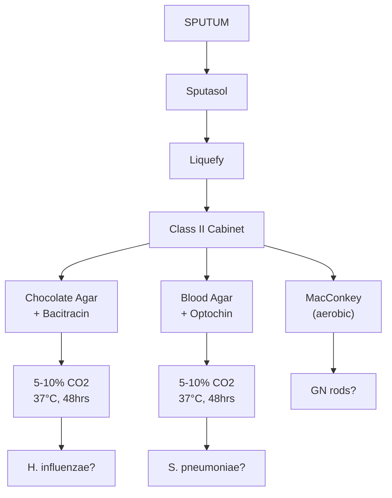
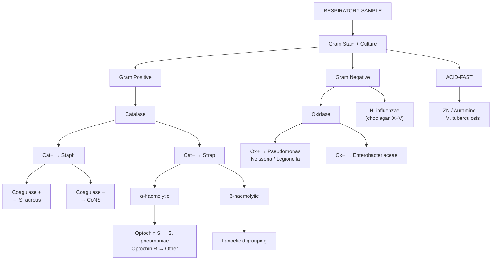

# Lecture 3: Respiratory Tract Infections

## Table of Contents
1. [Learning Outcomes](#1-learning-outcomes)
2. [Normal Respiratory Flora](#2-normal-respiratory-flora)
3. [Respiratory Pathogens](#3-respiratory-pathogens)
4. [Clinical Samples](#4-clinical-samples)
5. [Sputum Processing](#5-sputum-processing)
6. [Blood Culture Diagnosis](#6-blood-culture-diagnosis)
7. [Streptococcus pneumoniae](#7-streptococcus-pneumoniae)
8. [Streptococcus pyogenes in RTI](#8-streptococcus-pyogenes-in-rti)
9. [Haemophilus influenzae](#9-haemophilus-influenzae)
10. [Legionella pneumophila](#10-legionella-pneumophila)
11. [Mycobacterium tuberculosis](#11-mycobacterium-tuberculosis)
12. [Treatment Summary](#12-treatment-summary)
13. [Identification Flowchart](#13-identification-flowchart)
14. [SDL Questions](#14-sdl-questions)
15. [Key Resources](#15-key-resources)

---

## 1. Learning Outcomes

- Evaluate and discriminate **normal respiratory flora** from pathogens
- Give examples of common RTI pathogens and associate symptoms with specific pathogens
- Discuss laboratory detection methods to confirm the aetiological agent
- Evaluate antimicrobial treatment including prophylaxis and prevention/control
- Discuss outbreaks and epidemiology for named pathogens

---

## 2. Normal Respiratory Flora

| Site | Normal Flora |
|---|---|
| **Nares** | *S. epidermidis*, *Corynebacteria*; **20-30%** carry *S. aureus* (higher in HCWs); **40%** carry *S. pneumoniae* |
| **Nasopharynx** | Streptococci, Staphylococci, *Neisseria* spp |
| **Pharynx** | Occasional: *H. influenzae*, *S. pneumoniae*, *S. pyogenes*, *N. meningitidis* |
| **Sinuses** | Should be **sterile** |
| **LRT** | Should be **mostly sterile** (mucociliary escalator + cough reflex) |

---

## 3. Respiratory Pathogens

### 3.1 By Region

| Region | Pathogens |
|---|---|
| **URT** | *S. aureus*, *N. meningitidis*, *S. pyogenes*, *C. diphtheriae* |
| **LRT** | *H. influenzae*, *K. pneumoniae*, *P. aeruginosa*, *B. pertussis*, *L. pneumophila*, *M. tuberculosis*, *S. pneumoniae*, *C. burnetii* |

### 3.2 Complete List

| Category | Organisms |
|---|---|
| **Bacteria** | *H. influenzae*, *Burkholderia cepacia* (CF), *P. aeruginosa* (CF), *K. pneumoniae*, *E. coli*, *B. pertussis* (whooping cough), *L. pneumophila* (Legionnaires), *C. burnetii* (Q fever), *S. aureus*, *M. tuberculosis*, *S. pneumoniae* |
| **Viruses** | Influenza A/B, SARS-CoV/SARS-CoV-2, Swine Flu H1N1, RSV, Avian Influenza H5N1/H5N5, Rhinovirus |
| **Fungi** | *Aspergillus niger*, *Coccidioides immitis* (Valley Fever), *Pneumocystis carinii/jirovecii* |
| **Parasite** | *Paragonimus westermanii* (lung fluke) |

### 3.3 Clinical Presentations

| Pathogen | Disease | Key Features |
|---|---|---|
| *S. pneumoniae* | **Community-acquired pneumonia** | Acute onset; rusty sputum; lobar consolidation on CXR; rigors |
| *H. influenzae* | Exacerbation of COPD, otitis media | Purulent sputum; children: otitis media, epiglottitis (type b) |
| *S. pyogenes* | **Pharyngitis/tonsillitis** | Sore throat, exudate on tonsils, cervical lymphadenopathy |
| *L. pneumophila* | **Legionnaires' disease** | Atypical pneumonia; confusion, diarrhoea, hyponatraemia; no person-to-person spread |
| *M. tuberculosis* | **Pulmonary TB** | Chronic cough (>3 weeks), night sweats, weight loss, haemoptysis |
| *B. pertussis* | **Whooping cough** | Paroxysmal cough with inspiratory "whoop"; post-tussive vomiting; 100-day cough |
| *C. diphtheriae* | **Diphtheria** | Grey pharyngeal pseudomembrane; bull neck; toxin causes myocarditis |
| *C. burnetii* | **Q fever** | Atypical pneumonia; contact with farm animals/birth products; hepatitis |
| Influenza A/B | **Influenza** | Sudden onset fever, myalgia, dry cough; annual epidemics |
| RSV | **Bronchiolitis** | Infants <1yr; wheeze, tachypnoea, feeding difficulty |

### 3.4 Bordetella pertussis (Whooping Cough)

| Feature | Detail |
|---|---|
| Organism | **Fastidious GN coccobacillus**; strict aerobe |
| Transmission | **Respiratory droplets**; highly infectious (R0 ~12-17) |
| Incubation | 7-10 days |
| Stages | **Catarrhal** (1-2 wks, most infectious) --> **Paroxysmal** (2-8 wks, whooping) --> **Convalescent** (weeks-months) |
| Sample | **Pernasal swab** or cough plate; nasopharyngeal aspirate |
| Culture | **Bordet-Gengou agar** or Regan-Lowe charcoal agar; 7 days, 35C |
| Molecular | **PCR** now preferred (faster, more sensitive than culture) |
| Serology | Anti-pertussis toxin IgG |
| Vaccination | **DTaP** (children); booster in pregnancy (UK: 16-32 weeks) |
| Treatment | **Erythromycin/Azithromycin** (macrolides); reduces transmission if given early |

### 3.5 Vaccination and Prevention

| Pathogen | Vaccine/Prevention |
|---|---|
| *S. pneumoniae* | **PCV13** (children) / **PPV23** (adults >65, at-risk); splenectomy patients |
| *H. influenzae* type b | **Hib vaccine** (childhood schedule); dramatic reduction in meningitis/epiglottitis |
| *M. tuberculosis* | **BCG vaccine** (neonates in high-risk areas); variable efficacy (0-80%) |
| *B. pertussis* | **DTaP/Tdap**; maternal vaccination in pregnancy |
| Influenza | **Annual flu vaccine**; live attenuated (children) or inactivated (adults) |
| *C. diphtheriae* | **DTaP** (childhood); toxoid vaccine |

---

## 4. Clinical Samples

| Sample | Indication |
|---|---|
| **Sputum** | Most common RTI sample |
| **Nasopharyngeal aspirate** | Neonates, viral detection |
| **Endotracheal aspirate** | Ventilated patients |
| **BAL** (bronchoalveolar lavage) | Via bronchoscope; less contamination |
| **Cough plates/swabs** | *B. pertussis* specifically |
| **Blood culture** | Bacteraemia/septicaemia |
| **Environmental water** | Cooling towers/AC units for *Legionella* |

---

## 5. Sputum Processing

### 5.1 Patient Instructions

- No food **1-2 hours** before; rinse mouth with **saline/water**
- Deep breath, cough, expectorate into **sterile CE-marked container**
- Send immediately

### 5.2 Lab Processing

1. **Sputasol (dithiothreitol)**: equal volume to liquefy (37C/RT; make fresh, keeps 48hrs at 4C)
2. **Inoculate** (in this order): Chocolate agar > Blood agar > MacConkey agar
3. **Discs**: Optochin (P) on blood agar for *S. pneumoniae*; Bacitracin (10U) on chocolate agar for *H. influenzae*
4. **Incubation**: 5-10% CO2, 37C, 48 hours

> **Why this order?** Chocolate agar first -- fastidious organisms need max inoculum. Each plate gets less material.

### 5.3 Safety

- Process in **Class II Safety Cabinet** (Category 3 Room) -- risk of *M. tuberculosis*
- HEPA-filtered laminar airflow protects operator

---

## 6. Blood Culture Diagnosis

### 6.1 Collection

- Aseptic technique critical (contamination = false positives)
- Wash hands, alcohol wipe, do NOT re-palpate cleaned site

### 6.2 BacTAlert System

- 37C, constantly shaken, checked every 10 mins
- 12-48 hrs: CO2 triggers sensor -- bottle flagged **positive**
- Positive: Gram stain 1-2 drops; **communicate to clinician immediately**

---

## 7. Streptococcus pneumoniae

| Feature | Detail |
|---|---|
| Importance | Pneumonia in all ages; mortality greatest **>70 yrs**; <2 and >65 most at risk |
| Splenectomy | High risk of overwhelming infection |
| Colony | **Alpha-haemolytic** (greenish); sometimes mucoid (capsulated = more virulent) |
| Atmosphere | 5-10% CO2 (20% only grow anaerobically) |
| **Autolysis** | Colonies self-destruct -- detection problem |
| **Optochin** | **Sensitive** (zone around P disc) -- differentiates from other alpha-strep |
| Latex | Wellcogen kit for non-viable organisms in CSF/blood/culture bottles |
| Gram stain | GP **lancet-shaped diplococci** |
| Treatment | **Penicillin** or **Erythromycin**; vaccination PCV13/PPV23 |

---

## 8. Streptococcus pyogenes in RTI

- **Beta-haemolytic** on blood agar
- **Lancefield grouping** (Streptex): Group A = *S. pyogenes*
- **Catalase negative** (differentiates from Staphylococci)
- Catalase will NOT differentiate *S. pneumoniae* from other alpha-strep

---

## 9. Haemophilus influenzae

### 9.1 Key Facts

- **Fastidious** GN coccobacillus; requires **chocolate agar** (CO2, 48hrs, 37C)
- Causes RTIs, meningitis, otitis media (children), eye infections (neonates)

### 9.2 Growth Factors

- Needs **X factor (haemin)** AND **V factor (NAD)** -- both required
- X+V disc test: growth only around disc with both factors

### 9.3 Why Not on Blood Agar?

- Intact RBCs hold X and V factors inside; **chocolate agar** lyses RBCs, releasing them
- **Satellitism**: tiny colonies around *S. aureus* (which lyses RBCs, releasing V factor)

### 9.4 Bacitracin

- 10U disc inhibits GP and *Neisseria*; *H. influenzae* is **resistant** (grows to disc)

---

## 10. Legionella pneumophila

### 10.1 Key Facts

- Aerobic, faintly-staining GN rod; **ubiquitous in water**
- Transmission: **aerosol inhalation** (NOT human-to-human)
- **Intracellular parasite** of amoebae and alveolar macrophages
- *L. pneumophila* Sg1 causes most disease; >40 species
- ~400 cases/yr UK; >50% travel-associated; 10-15% mortality

### 10.2 Lab Diagnosis

| Method | Details |
|---|---|
| Gram stain | Faintly visible; extend **safranin to 10+ mins** |
| **Urine antigen** | POCT (Abbott); rapid Sg1 detection |
| Culture | **BCYE agar** + antibiotic cocktail; up to **7 days**; humidified, aerobic, 37C |
| DIF | Not very sensitive |

### 10.3 Treatment

- **Erythromycin** (or fluoroquinolone / newer macrolide)
- Prevention: run taps weekly; maintain water systems

### 10.4 Epidemiology

- France/Germany/Italy/Spain = ~70% European cases; travel-associated

---

## 11. Mycobacterium tuberculosis

### 11.1 Staining

| Method | Result | Use |
|---|---|---|
| **ZN** | Red bacilli on blue | Gold standard |
| **Auramine-Phenol** | Yellow-green on dark | More sensitive; LMICs |

### 11.2 Culture

| Method | Details |
|---|---|
| **LJ agar** | Up to **8 weeks**; rough buff colonies |
| **BACTEC MGIT** | Automated liquid culture; fluorescent O2 sensor |

> All require **Petroff decontamination** (NaOH) before culture.

### 11.3 Molecular

- **Xpert MTB/RIF**: detects MTBC + rifampicin resistance (rapid)

### 11.4 Treatment (6 months)

**RIPE**: Rifampicin + Isoniazid + Pyrazinamide + Ethambutol; **DOT** recommended
- **MDR-TB**: R+I resistant; **XDR-TB**: MDR + fluoroquinolone + injectable

---

## 12. Treatment Summary

| Pathogen | Treatment |
|---|---|
| *S. pneumoniae* | Penicillin or Erythromycin |
| *H. influenzae* | Amoxicillin or Ceftriaxone |
| *Legionella* | Fluoroquinolone or macrolide |
| *M. tuberculosis* | RIPE x 6 months (DOT) |
| *S. pyogenes* | Penicillin or Erythromycin |

> **Problem**: GPs prescribe antibiotics for **viral** RTIs -- promotes resistance.

---

## 13. Identification Flowchart

---

## 14. SDL Questions

1. **Why Class II Cabinet?** *M. tuberculosis* risk (CL3); HEPA-filtered laminar airflow protects operator from aerosolised organisms
2. **Why chocolate agar first?** Max inoculum for fastidious organisms (*H. influenzae* needs most material); each subsequent plate gets less
3. **Why poor growth on blood agar for *H. influenzae*?** X (haemin) and V (NAD) factors are locked inside intact RBCs; chocolate agar lyses RBCs releasing both factors
4. **Why sputum Gram stain limited?** Normal oropharyngeal flora contaminates specimen; need to assess quality (>25 PMNs, <10 SECs per LPF = acceptable)
5. **Phenotypic vs molecular TB detection?** ZN+LJ: cheap/slow (8wks); Xpert MTB/RIF: rapid/expensive, detects rifampicin resistance via rpoB gene mutations
6. **What is satellitism?** *H. influenzae* growing as tiny colonies around *S. aureus* on blood agar -- *S. aureus* lyses RBCs releasing V factor (NAD)
7. **Why is autolysis a problem for *S. pneumoniae*?** Colonies self-destruct on prolonged incubation; may give false-negative cultures if plates read late
8. **Compare CAP vs atypical pneumonia presentation?** CAP (*S. pneumoniae*): acute, productive rusty sputum, lobar consolidation. Atypical (*Legionella*, *Mycoplasma*): insidious, dry cough, extrapulmonary features (confusion, diarrhoea)

---

## 15. Key Resources

- **SMI B-57**: Sputum investigation; **SMI TP-39**: Staining procedures
- ECDC Legionella GIS: https://legionnaires.ecdc.europa.eu/gistool/
- EUCAST RAST: https://www.eucast.org/rapid_ast_in_bloodcultures
- **YouTube**: Ninja Nerd, Medicosis Perfectionalis, Dr. Matt
