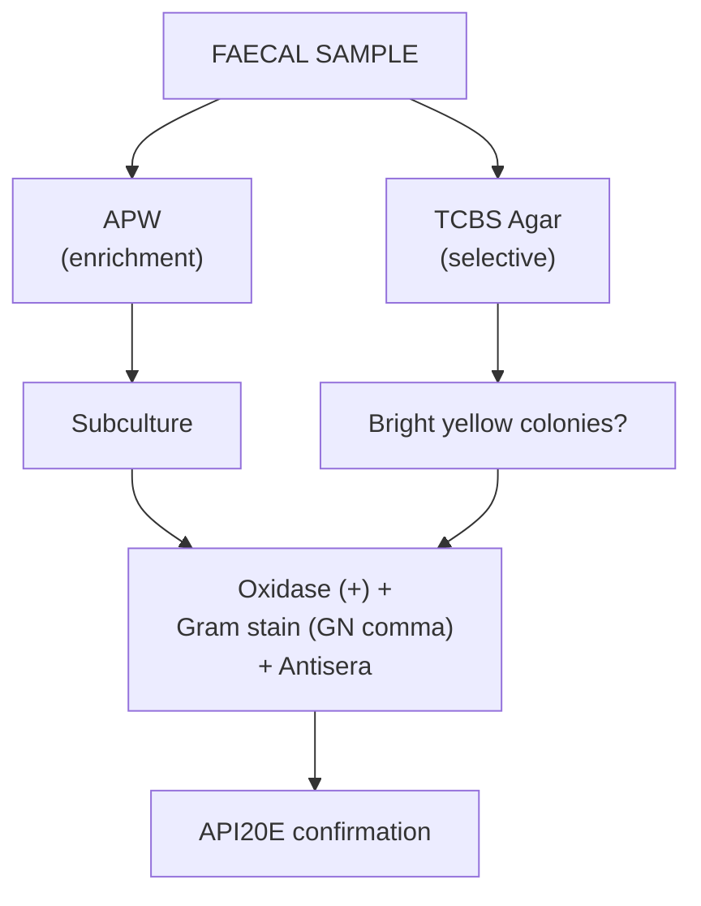
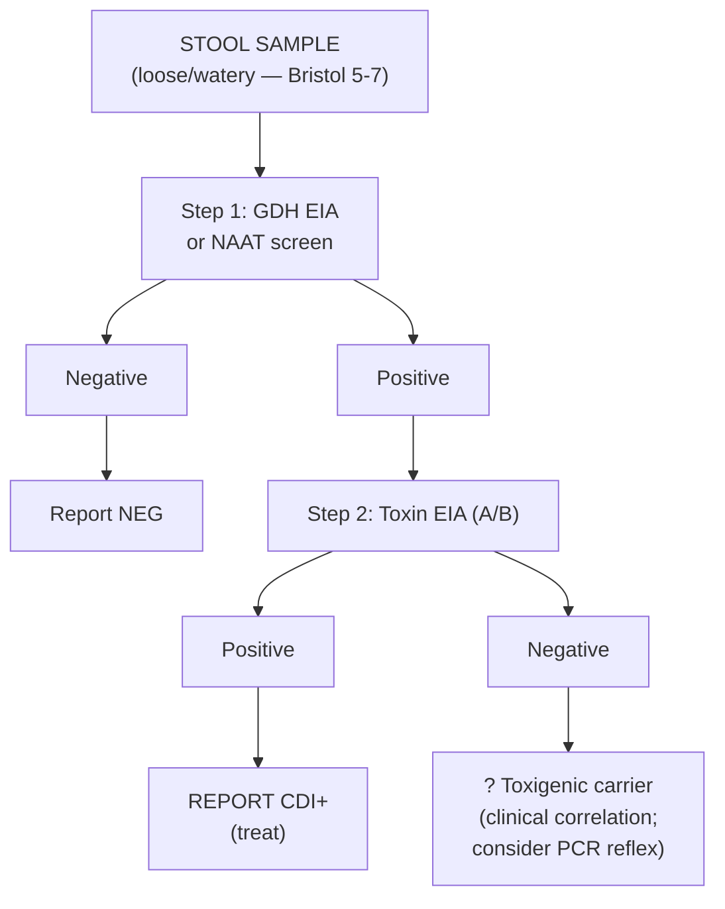

# Lecture 4: Gastrointestinal Infections

## Table of Contents
1. [Learning Outcomes](#1-learning-outcomes)
2. [GI Pathogens Overview](#2-gi-pathogens-overview)
3. [GI Disease Symptoms](#3-gi-disease-symptoms)
4. [Transmission Methods](#4-transmission-methods)
5. [Vibrio cholerae](#5-vibrio-cholerae)
6. [Campylobacter](#6-campylobacter)
7. [Salmonella](#7-salmonella)
8. [Norovirus](#8-norovirus)
9. [Clostridium difficile](#9-clostridium-difficile-healthcare-associated)
10. [Escherichia coli O157 (STEC)](#10-escherichia-coli-o157-stecvtec)
11. [Helicobacter pylori](#11-helicobacter-pylori)
12. [Food-Associated Outbreaks](#12-food-associated-outbreaks)
13. [Laboratory Detection of GI Infections](#13-laboratory-detection-of-gi-infections)
14. [Outbreak Surveillance](#14-outbreak-surveillance)
15. [SDL Questions](#15-sdl-questions)
16. [Key Resources](#16-key-resources)

---

## 1. Learning Outcomes

- Give examples of common GI pathogens and associated clinical presentations
- Demonstrate understanding of GI infectious disease symptoms
- Describe virulence factors enabling pathogens to initiate infection
- Analyse role of automated platforms vs phenotypic methods in diagnostic microbiology
- Provide examples of current UK surveillance methods for GI infections
- Describe how infectious disease outbreak management occurs at local, regional, national, and international level

---

## 2. GI Pathogens Overview

### 2.1 Bacterial Pathogens

| Pathogen | Disease | Notes |
|---|---|---|
| *Campylobacter jejuni* | Campylobacteriosis | **Commonest** food-associated infection in UK |
| *E. coli* O157* | Haemolytic Uraemic Syndrome (HUS) | Toxin-producing |
| *Salmonella enteritidis* | Salmonellosis | Common UK serotype |
| *Salmonella typhi* | Typhoid (enteric fever) | Serotype O9:Vi |
| *Vibrio cholerae** | Cholera | Pandemic pathogen; 7 pandemics recorded |
| *V. parahaemolyticus** | Gastroenteritis | Seafood-associated (especially Japan) |
| *Aeromonas hydrophila* | Gastroenteritis | Environmental |
| *Yersinia enterocolitica* | Yersiniosis | |
| *Shigella sonnei* | Dysentery | |
| *Helicobacter pylori* | Gastritis/ulcers | Spiral bacterium |
| *Listeria monocytogenes** | Listeriosis | |
| *Clostridium difficile** | Pseudomembranous colitis | **HAI** (healthcare-associated) |
| *Staphylococcus aureus** | Food poisoning | Toxin-mediated |
| *Bacillus cereus** | Food poisoning | Toxin-mediated |
| *Clostridium perfringens** | Food poisoning | Toxin-mediated |
| *Clostridium botulinum** | Botulism | Respiratory paralysis |

> \* = toxin-producing (virulence factor)

### 2.2 Viral and Protozoal Pathogens

| Category | Pathogens |
|---|---|
| **Viruses** | Norovirus (Norwalk), Enteroviruses, Hepatitis A and C, Rotavirus |
| **Protozoa** | *Cryptosporidium parvum*, *Cyclospora cayetanensis*, *Giardia lamblia* (traveller's diarrhoea), *Entamoeba histolytica* (also STD) |
| **Helminths** | *Enterobius vermicularis* (threadworms -- common UK schoolchildren), *Ascaris*, *Trichuris*, *Strongyloides*, *Diphyllobothrium latum* |

### 2.3 Key Virulence Factors

| Pathogen | Virulence Factor | Mechanism |
|---|---|---|
| *V. cholerae* | **Cholera toxin (CT)** | ADP-ribosylates Gs protein --> permanent activation of adenylate cyclase --> massive Cl-/H2O secretion --> **rice-water diarrhoea** |
| *E. coli* O157 | **Shiga toxin (Stx1/Stx2)** | Inhibits 60S ribosomal subunit --> cell death; damages renal endothelium --> **HUS** |
| *S. aureus* | **Enterotoxins A-E** | Heat-stable; preformed in food; cause vomiting within **1-6 hours** (short incubation) |
| *B. cereus* | **Emetic toxin (cereulide)** | Heat-stable; preformed in **reheated rice**; vomiting within 1-5 hrs |
| | **Diarrhoeal toxin** | Heat-labile; produced in gut; diarrhoea after 8-16 hrs |
| *C. botulinum* | **Botulinum toxin** | Most potent biological toxin; blocks ACh release at NMJ --> **flaccid paralysis** |
| *C. difficile* | **Toxin A (TcdA)** and **Toxin B (TcdB)** | Glycosyltransferases; inactivate Rho GTPases --> cytoskeletal disruption, cell death, inflammation --> **pseudomembranous colitis** |
| *C. perfringens* | **Enterotoxin (CPE)** | Pore-forming; produced during sporulation in gut |
| *Salmonella* | **Type III secretion system** | Injects effector proteins into host cells --> invasion of intestinal epithelium |
| *Shigella* | **Shiga toxin** + invasion | Invades colonic epithelium --> dysentery (bloody mucoid diarrhoea) |
| *H. pylori* | **Urease** + **CagA** + **VacA** | Urease neutralises gastric acid; CagA injected into host cells; VacA causes vacuolation |

> **Exam tip**: Know the difference between **toxin-mediated** (preformed toxin = short incubation, e.g. *S. aureus* 1-6 hrs) vs **infection-mediated** (organism multiplies = longer incubation, e.g. *Salmonella* 12-72 hrs)

---

## 3. GI Disease Symptoms

| Symptom | Associated Pathogen(s) |
|---|---|
| Diarrhoea, vomiting, abdominal pain | Most GI pathogens |
| Haematuria (blood in urine) | Specific infections |
| Weight loss, pyrexia | Chronic/systemic infections |
| **Respiratory paralysis** | *C. botulinum* |
| **Megacolon / Pseudomembranous colitis** | *C. difficile* (antibiotic-associated diarrhoea) |
| **Haemolytic uraemic syndrome (HUS)** | *E. coli* O157 |
| Multi-organ failure | Severe systemic infection |

---

## 4. Transmission Methods

| Route | Examples |
|---|---|
| **Food** | *Salmonella*, *Campylobacter*, *Listeria*, *B. cereus* |
| **Water / Environmental** | *V. cholerae*, *Cryptosporidium*, soil/animal products |
| **Direct contact / Faecal-oral** | *Salmonella*, *E. histolytica* via contaminated food/water |
| **Inhalation** | Norovirus (aerosolised vomit) |
| **Sexually transmitted** | *E. histolytica* (MSM) |

---

## 5. Vibrio cholerae

### 5.1 Key Facts

- Cause of **7 historic pandemics**; global public health threat
- Incubation: **12 hours to 5 days**; may be asymptomatic 1-10 days
- Predictable, preventable disease
- **Yemen outbreak** (Oct 2016-2020): largest ever recorded; >1 million cases. Oral cholera vaccines (OCVs) delayed 3.5 years into outbreak

### 5.2 Laboratory Detection

| Step | Details |
|---|---|
| **Sample** | Faeces/stool or water |
| **Selective agar** | **TCBS** (Thiosulphate Citrate Bile Sucrose) agar |
| **Enrichment** | **Alkaline Peptone Water** (APW) |
| **Incubation** | Aerobic, 37C, 24 hrs |
| **Colony appearance** | **Bright yellow** on TCBS |
| **Gram stain** | GN **comma-shaped** bacterium |
| **Oxidase** | **Positive** (from NA slope) |
| **Confirmation** | Antisera + API20E (member of Enterobacteriaceae) |

### 5.3 Prevention and Control (LEDCs)

- Public health awareness campaigns
- Education of population
- Improved infrastructure, healthcare, sanitation
- Public health surveillance
- Oral cholera vaccines (OCVs)

---

## 6. Campylobacter

### 6.1 Key Facts

- **Commonest** cause of food-associated infections in UK
- Main species: *C. jejuni* and *C. coli*
- HPA Sentinel Surveillance (2000-2003): *C. jejuni* most common; >50% travel-associated; incidence underestimated by **7x reported cases**

### 6.2 Laboratory Detection

| Feature | Detail |
|---|---|
| **Gram stain** | GN **S-shaped** bacillus (use dilute carbol fuchsin as counterstain) |
| **Oxidase** | **Positive** |
| **Motility** | **Tumbling** motility (dark ground microscopy) |
| **Growth** | **42C**, microaerophilic, 24-48 hrs |
| **Agar** | **Selective Campylobacter agar** |
| **Species ID** | **API Campy** test strip (Biomerieux) -- result in 24 hours |

> Easy presumptive identification: Gram stain (GN S-shaped) + Oxidase positive + tumbling motility

---

## 7. Salmonella

### 7.1 Common UK Serotypes

| Serotype | Antigenic Formula | Disease |
|---|---|---|
| *S. enteritidis* | **O9:G** | Salmonellosis |
| *S. typhimurium* | **O4:i** | Salmonellosis |
| *S. typhi* | **O9:Vi** | **Typhoid** (enteric fever) |

> *S. enteritidis* and *S. typhi* share the same O antigen (O9) -- correct flagellar (H) antigen identification is critical

### 7.2 Laboratory Detection

| Feature | Detail |
|---|---|
| **Gram stain** | GN bacillus |
| **Oxidase** | **Negative** (distinguishes from *Pseudomonas* -- always oxidase positive) |
| **Indole** | Negative |
| **H2S production** | **Positive** (black colour on TSI) |
| **Motility** | Most motile (exception: *S. gallinarum*) |
| **Growth** | 37C, aerobic, 24 hrs |
| **Selective agar** | **XLD**, DCA, Bismuth sulphate, Hektoen agar |
| **Enrichment** | **Selenite broth** (sodium selenite inhibits GP and other GN bacteria) |

> **Safety**: Selenite is **mutagenic** -- use PPE (plastic gloves)

### 7.3 Confirmation Methods

| Method | Details |
|---|---|
| **TSI** (Triple Sugar Iron) | H2S (black) + gas bubbles |
| **API20E** | Confirms *Salmonella* genus (not serotype) |
| **Vitek2** | Automated ID -- confirms *Salmonella* (not serotype) |
| **Slide agglutination** | O and H antisera on pure colonies (CLED agar -- non-lactose fermenter) |
| **Serotyping** | Kaufmann-White scheme; reference lab for phage typing |

> All *Salmonella* isolates from patient samples are **reported to UKHSA** for national surveillance

### 7.4 Cadbury's Outbreak (2006)

- March-July 2006: 56 isolates of *S. montevideo*
- Internal records showed contamination since 2003
- Source: **leaking drainpipe** contaminated crumb
- >1 million chocolate bars withdrawn
- Result: **GBP 1M fine** + 14% drop in sales

---

## 8. Norovirus

### 8.1 Key Facts

- Leading cause of **viral gastroenteritis**
- **Highly infectious**: aerosolised transmission
- Hospital ward outbreaks (HAI) with **seasonal** pattern
- Alcohol gel **less effective** than **soap and water** handwashing

### 8.2 Fat Duck Outbreak (2009)

- **Largest ever norovirus restaurant outbreak in UK**
- >500 people affected (diners and staff)
- Source: **oysters/clams**
- Restaurant criticised by HPA for **delay in reporting** -- led to larger numbers (~400+)
- Blumenthal not prosecuted
- 2014: Second norovirus outbreak at Blumenthal's "Dinner" restaurant (Mandarin Oriental)

---

## 9. Clostridium difficile (Healthcare-Associated)

### 9.1 Key Facts

- Leading cause of **antibiotic-associated diarrhoea (AAD)** in hospitals
- Risk factors: **broad-spectrum antibiotics** (especially cephalosporins, fluoroquinolones, clindamycin), age >65, prolonged hospital stay, PPI use
- Produces **Toxin A** (enterotoxin) and **Toxin B** (cytotoxin); some strains produce **binary toxin (CDT)**
- **Ribotype 027** (NAP1): hypervirulent strain; produces 16x more toxin A, 23x more toxin B; associated with severe outbreaks

### 9.2 Clinical Spectrum

| Severity | Features |
|---|---|
| Mild | Watery diarrhoea (>3 loose stools/24hrs) |
| Moderate | Profuse diarrhoea, abdominal pain, fever, raised WCC |
| Severe | **Pseudomembranous colitis** (yellow-white plaques on colonoscopy); raised lactate, WCC >15 |
| Life-threatening | **Toxic megacolon**, ileus, shock, perforation |

### 9.3 Laboratory Diagnosis -- Two-Step Algorithm (UK Standard)

| Test | Sensitivity | Specificity | Notes |
|---|---|---|---|
| **GDH EIA** | >90% | ~75% | Detects common antigen; cannot distinguish toxigenic from non-toxigenic |
| **Toxin EIA (A/B)** | ~75% | >95% | Detects free toxin; confirms active disease |
| **NAAT/PCR (tcdB)** | >95% | ~95% | Detects toxin gene; may detect carriers (not active disease) |
| **Cytotoxin assay** | Gold standard | Gold standard | CPE on cell culture; slow (48 hrs); reference labs only |

### 9.4 Treatment

| Severity | Treatment |
|---|---|
| **First episode (mild-moderate)** | **Oral vancomycin** 125mg QDS x 10 days (or fidaxomicin) |
| **Severe** | Oral vancomycin 125-500mg QDS +/- IV metronidazole |
| **Recurrent (>2 episodes)** | **Faecal microbiota transplantation (FMT)** -- restores normal gut flora; >90% cure rate |

> **Key**: STOP the causative antibiotic if possible; **isolate patient**; contact precautions; **soap and water** handwashing (alcohol gel does NOT kill *C. difficile* spores)

---

## 10. Escherichia coli O157 (STEC/VTEC)

### 10.1 Key Facts

- **Shiga toxin-producing *E. coli*** (STEC) -- also called VTEC (verocytotoxin-producing)
- Serotype **O157:H7** most common in UK; low infectious dose (~10-100 organisms)
- Source: undercooked beef, unpasteurised milk, contaminated water, petting farms
- Incubation: 1-10 days (usually 3-4 days)

### 10.2 Clinical Features

- Bloody diarrhoea (haemorrhagic colitis) --> may progress to **HUS** (5-15% of cases)
- **HUS triad**: microangiopathic haemolytic anaemia + thrombocytopenia + acute kidney injury
- **Children <5** most at risk for HUS; potentially fatal

### 10.3 Laboratory Detection

| Method | Detail |
|---|---|
| **Sorbitol MacConkey agar** (SMAC) | *E. coli* O157 is **sorbitol non-fermenter** (colourless) -- most *E. coli* ferment sorbitol (pink) |
| **Latex agglutination** | O157 antisera on suspect colonies |
| **Shiga toxin detection** | EIA or **PCR for stx1/stx2 genes** |
| **Referral** | All STEC isolates sent to **UKHSA reference lab** for typing |

> **Important**: Do NOT give antibiotics for STEC -- may increase toxin release and HUS risk

---

## 11. Helicobacter pylori

| Feature | Detail |
|---|---|
| Organism | Microaerophilic GN spiral/curved rod |
| Disease | **Gastritis, peptic/duodenal ulcers**; associated with **gastric MALT lymphoma** and **gastric adenocarcinoma** |
| Prevalence | ~50% of world population infected; higher in LEDCs |
| Virulence | **Urease** (neutralises gastric acid), **CagA** (oncogenic), **VacA** (cytotoxin) |

### 11.1 Diagnosis

| Method | Type | Detail |
|---|---|---|
| **Urea breath test (UBT)** | Non-invasive | Patient swallows ^13C-urea; urease cleaves it; ^13CO2 measured in breath. **Gold standard** non-invasive test |
| **Stool antigen test** | Non-invasive | EIA for *H. pylori* antigens in faeces |
| **Serology** | Non-invasive | IgG antibodies; cannot distinguish current from past infection |
| **CLO test (rapid urease)** | Invasive | Biopsy placed in urea-containing medium; colour change if urease positive |
| **Histology** | Invasive | Giemsa or silver stain of gastric biopsy |
| **Culture** | Invasive | Microaerophilic, 37C, 5-7 days; for AST in treatment failure |

### 11.2 Treatment -- Triple Therapy

- **PPI + Amoxicillin + Clarithromycin** x 7-14 days (or PPI + Metronidazole + Clarithromycin)
- Test of cure: repeat UBT at **4-6 weeks** post-treatment

---

## 12. Food-Associated Outbreaks

### 9.1 Definition

- **Outbreak**: two or more cases linked epidemiologically (in time or space)
- **Food-associated outbreak**: ingestion of microbe or its toxins causing disease
- Some pathogens cause disease via **toxin**: *S. aureus*, *B. cereus*, *Clostridium* spp

### 9.2 Birmingham Outbreak

- Police officers hospitalised after eating contaminated chicken and tuna sandwiches

---

## 13. Laboratory Detection of GI Infections

### 10.1 Clinical Samples

| Sample | Use |
|---|---|
| **Faeces / "hot stool"** | Most common; for jejunal aspirate (amoebae, *Giardia*) |
| **Urine** | Concentration methods for *Cryptosporidium*, *Schistosoma* |
| **Blood culture / Widal test** | *S. typhi* (predominantly LEDCs) |
| **Rectal swabs** | Neonates, children, elderly |
| **Environmental samples** | Food/water for outbreak investigation |

### 10.2 Processing Approach

1. **Selective agar media** -- discriminate enteric pathogens from commensal bowel flora
2. **Phenotypic/biochemical ID**: API20E, API10S, Vitek2
3. **Food samples** processed under **UKAS standards** (transition from CPA completed Sep 2018)
4. **Clinical history critical** -- especially foreign travel; informs which tests to request
5. **Toxin assays**: *C. difficile* toxin -- ELISA, EIA, PCR
6. **Serology**: Widal test for typhoid (still widely used in LEDCs)
7. **Parasites**: Modified ZN, Auramine; concentration methods; direct microscopy for *Cryptosporidium*, *Giardia*, *Entamoeba*, oocysts

---

## 14. Outbreak Surveillance

### 11.1 UK Structure

| Organisation | Role |
|---|---|
| **UKHSA** (formerly PHE/HPA/PHLS) | National surveillance and control |
| **Local Authorities** (Environmental Health) | Local investigation |
| **LACORS** (now LG Regulation) | Local authority coordination |
| **NHS** | Healthcare response |
| **NOIDS** | Notifications of Infectious Diseases |
| **UKHSA Labs** | Surveillance from laboratory-confirmed cases |

### 11.2 Reporting

- All *Salmonella* isolates reported to UKHSA
- Health Protection Reports published monthly/quarterly
- **NOIDS**: mandatory notification of specified infectious diseases

---

## 15. SDL Questions

1. **What constitutes a food-associated outbreak?** Two or more cases linked epidemiologically; ingestion of microbe or its toxins causing disease
2. **Why is selenite broth used?** Selective enrichment -- sodium selenite inhibits GP and other GN bacteria, allowing *Salmonella* to grow preferentially
3. **API20E vs Vitek2 for Salmonella?** Both confirm genus *Salmonella* but NOT serotype; serotyping requires antisera (Kaufmann-White) or reference lab phage typing
4. **Why is alcohol gel insufficient for norovirus?** Norovirus is a non-enveloped virus; soap and water handwashing is more effective
5. **Campylobacter presumptive ID?** GN S-shaped bacillus + oxidase positive + tumbling motility on dark ground microscopy
6. **How is *C. difficile* diagnosed?** Two-step algorithm: GDH/NAAT screen followed by toxin EIA confirmation. GDH detects all *C. difficile* (including non-toxigenic); toxin EIA confirms active disease
7. **Why no antibiotics for *E. coli* O157?** Antibiotics may increase Shiga toxin release via bacterial lysis, increasing risk of HUS
8. **What is the urea breath test?** Patient ingests ^13C-urea; *H. pylori* urease splits it to ^13CO2 + NH3; labelled CO2 detected in exhaled breath
9. **Differentiate toxin-mediated from infection-mediated food poisoning?** Toxin-mediated: short incubation (1-6 hrs), preformed toxin in food (*S. aureus*, emetic *B. cereus*). Infection-mediated: longer incubation (12-72 hrs), organism multiplies in host (*Salmonella*, *Campylobacter*)

---

## 16. Key Resources

- **SMI B-30**: Investigation of faecal specimens for enteric pathogens
- **API20E videos** (JISC-funded OERs): Preparation, performance, and interpretation
- **PHE/UKHSA**: Health Protection Reports -- Salmonella surveillance data
- **WHO Cholera**: https://www.who.int/health-topics/cholera
- **YouTube**: Ninja Nerd, Medicosis Perfectionalis, Dr. Matt
