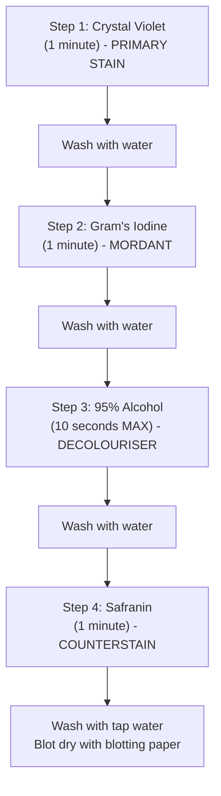
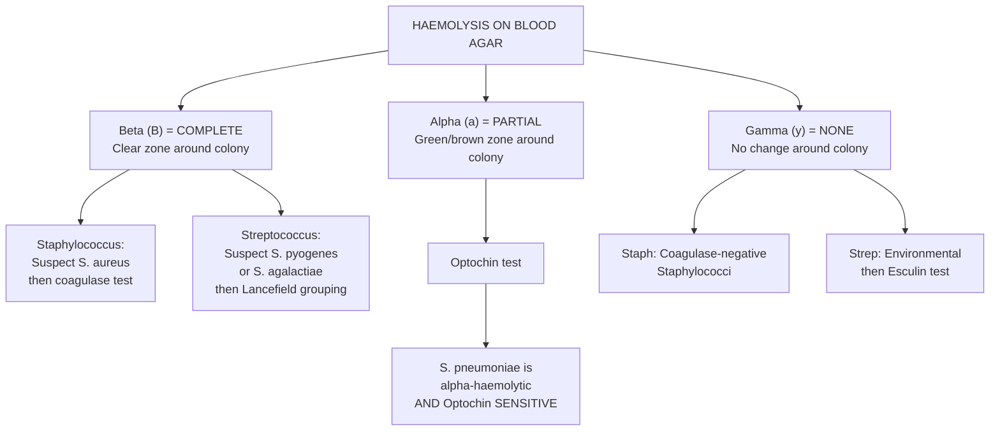
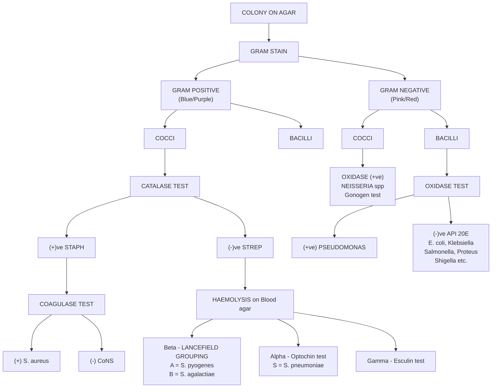

# BIOM3703 Laboratory Practicals: Clinical Microbiology Diagnostics

## Table of Contents
- [Learning Outcomes](#learning-outcomes)
- [Part 1: Health and Safety in the Microbiology Laboratory](#part-1-health-and-safety-in-the-microbiology-laboratory)
- [Part 2: The Gram Stain - Foundation of Bacterial Identification](#part-2-the-gram-stain---foundation-of-bacterial-identification)
- [Part 3: Confirmatory Biochemical Tests](#part-3-confirmatory-biochemical-tests)
- [Part 4: Clinical Case Studies - Sample-by-Sample Walkthrough](#part-4-clinical-case-studies---sample-by-sample-walkthrough)
- [Part 5: Mycology - Fungal Pathogen Identification](#part-5-mycology---fungal-pathogen-identification)
- [Part 6: Quality Assurance in Clinical Microbiology](#part-6-quality-assurance-in-clinical-microbiology)
- [Part 7: Diagnostic Identification Flowcharts](#part-7-diagnostic-identification-flowcharts)
- [Part 8: MCQ Practice with Explanations](#part-8-mcq-practice-with-explanations)
- [Self-Directed Learning Resources](#self-directed-learning-resources)

---

## Learning Outcomes

By the end of these practicals, you should be able to:

1. **Work safely** with microbial pathogens and understand how Health & Safety measures reduce laboratory-acquired infections
2. **Process and interpret patient samples** on various agar culture media, explaining the rationale behind agar/enrichment broth/incubation conditions chosen
3. **Correctly identify significant pathogens** using appropriate diagnostic tests, algorithms, and understand semi-automated/automated identification methods
4. **Distinguish between significant pathogens and normal flora** using quantitative methods
5. **Understand External Quality Assessment** (UKNEQAS) and the value of UKAS accreditation in clinical microbiology

---

## Part 1: Health and Safety in the Microbiology Laboratory

### Why This Matters
Laboratory-acquired infections (LAIs) are a real risk. Every rule exists because someone was harmed when it wasn't followed. Clinical microbiology labs handle genuinely dangerous organisms daily.

### Essential Rules

| Rule | Rationale |
|------|-----------|
| No eating, drinking, chewing, or using earphones | Prevents oral/mucosal route of infection; earphones require touching ears |
| Wear a Howie-style lab coat (fully buttoned) | This specific coat design has no open front and covers street clothes completely |
| Use racks for ALL tubes/bottles containing microbes | Free-standing containers tip over, creating aerosols and splashes |
| Use correct discard containers | Autoclaving requires proper containment; wrong bin = wrong decontamination |
| Keep agar plate lids ON | Open plates release aerosols and allow contamination |
| Disinfect bench before AND after work | Good Laboratory Practice (GLP) - required in all UKAS-accredited labs |
| Do NOT wear plastic gloves near Bunsen flames | Gloves melt and cause severe burns |

### Key Safety Signs You Should Recognise
Clinical labs display mandatory signage including:
- **Biohazard symbol** (yellow triangle) - indicates infectious material present
- **"Laboratory coats must be worn"** - mandatory PPE
- **"No food or drink to be kept in refrigerator"** - clinical specimens stored there
- **Fire safety equipment** locations (foam/water extinguishers)
- **Cardiac arrest code 2222** - emergency number in NHS hospitals

> **Golden Rule**: If you are unsure about ANYTHING, ask the Laboratory Supervisor or Demonstrator. Never guess.

---

## Part 2: The Gram Stain - Foundation of Bacterial Identification

The Gram stain is the **single most important first step** in identifying any bacterium from culture. It tells you two critical things: the cell wall structure (Gram positive or negative) and the morphology (shape).

### Step-by-Step Gram Stain Protocol

#### Slide Preparation
1. **Label** a clean glass microscope slide with pencil (sample ID: A, B, C, etc.)
2. **Sterilise** a straight wire by heating to red-hot in the blue flame of the Bunsen burner
3. **Touch ONE colony** with the cooled wire and emulsify it in ONE drop of sterile diluent on the slide
4. **Air dry completely** - do NOT heat before fully dry

> **WHY air dry first?** Heating a wet slide causes the liquid to boil, splattering bacteria into aerosols (infection risk) and creating uneven smears that are difficult to interpret.

5. **Heat-fix** by passing the dried slide briefly through the hottest part of the Bunsen flame (2-3 passes)

> **WHY heat-fix?** Heat fixation kills the bacteria (safety), adheres them to the glass (so they don't wash off during staining), and makes them more permeable to stains.

#### Staining Procedure

#### Viewing the Slide
1. Add **one drop of immersion oil** directly onto the stained area
2. Start at **low power** (x10, yellow ring objective) to locate stained material
3. Switch to **oil immersion** (x100, white ring objective) for identification
4. **DO NOT** get oil on the Phase Contrast objective (x40, blue ring)
5. When finished, clean the oil immersion lens with lens tissue

#### Interpreting Results

| Gram Stain Result | Colour | Cell Wall | Examples |
|---|---|---|---|
| **Gram positive** | Blue/Purple | Thick peptidoglycan layer retains crystal violet-iodine complex | *S. aureus*, *Streptococcus* spp |
| **Gram negative** | Pink/Red | Thin peptidoglycan, outer membrane; alcohol removes crystal violet | *E. coli*, *Pseudomonas*, *Neisseria* |

#### Morphology Types

| Shape | Description | Arrangement Clues |
|---|---|---|
| **Cocci** | Spherical | Clusters (Staphylococcus), chains (Streptococcus), pairs/diplococci (Neisseria, Pneumococcus) |
| **Bacilli (rods)** | Rod-shaped | Single rods (E. coli), curved (Vibrio), S-shaped (Campylobacter) |
| **Yeast** | Large oval, budding | Much larger than bacteria, Gram positive staining |

#### Quality Control (QC)
Always run QC strains alongside your test samples:
- **NCTC *S. aureus*** = Gram positive cocci (blue clusters) - confirms crystal violet is working
- **NCTC *E. coli*** or ***Pseudomonas*** = Gram negative bacilli (pink rods) - confirms decolourisation and counterstain working

> **Clinical Pearl**: The most common Gram stain error is **over-decolourising** (too long in alcohol), which makes Gram-positive organisms appear Gram-negative. Keep to 10 seconds maximum.

---

## Part 3: Confirmatory Biochemical Tests

Once you have a Gram stain result, you follow an algorithmic approach to narrow down the identity. Each test is chosen based on the previous result.

### 3.1 Catalase Test

**Purpose**: Differentiates *Staphylococcus* (catalase **+ve**) from *Streptococcus* (catalase **-ve**)

**When to use**: When Gram stain shows **Gram positive cocci**

**Principle**: Catalase enzyme breaks down hydrogen peroxide (H2O2) into water and oxygen. Oxygen produces visible **bubbles**.

**Method**:
1. Place one drop of 3% H2O2 onto a clean glass slide
2. Using a sterile loop, pick up a colony and emulsify it in the H2O2
3. Observe for **immediate bubbling**

**Results**:

| Result | Observation | Interpretation |
|---|---|---|
| **Positive** | Vigorous bubbling | *Staphylococcus* spp (produces catalase enzyme) |
| **Negative** | No bubbles | *Streptococcus* spp (lacks catalase enzyme) |

> **Important**: Perform the catalase test on colonies from **non-blood-containing agar** (e.g., nutrient agar, CLED). Red blood cells contain catalase and will give a false positive result if you pick up blood agar along with the colony.

### 3.2 Coagulase Test (Slide Method)

**Purpose**: Differentiates pathogenic *Staphylococcus aureus* (coagulase **+ve**) from coagulase-negative staphylococci (CoNS, usually non-pathogenic normal flora)

**When to use**: After catalase test confirms *Staphylococcus*

**Principle**: *S. aureus* produces **bound coagulase** (clumping factor) on its cell surface, which reacts with fibrinogen in plasma to cause visible **agglutination** (clumping).

**Method**:
1. Place a loopful of **rabbit plasma** on a glass slide
2. Using a straight wire, emulsify the suspected *Staphylococcus* colony into the plasma
3. Rock gently and observe within 10 seconds

**Results**:

| Result | Observation | Interpretation |
|---|---|---|
| **Positive** | Visible clumping/agglutination | ***S. aureus*** confirmed |
| **Negative** | Smooth, milky suspension (no clumping) | Coagulase-negative staphylococcus (e.g., *S. epidermidis*) - likely normal flora |

> **Clinical Pearl**: If the slide coagulase is equivocal, a **tube coagulase test** (incubating bacteria in plasma at 37C for 4 hours) can be performed. This detects **free coagulase** (staphylocoagulase) and is considered the gold standard.

### 3.3 Oxidase Test

**Purpose**: Differentiates oxidase-positive from oxidase-negative Gram-negative bacteria

**When to use**: When Gram stain shows **Gram negative bacilli** OR **Gram negative diplococci**

**Principle**: Detects the presence of **cytochrome c oxidase** enzyme. The reagent TMPD (N,N,N',N'-tetramethyl-p-phenylenediamine) acts as an electron donor; if oxidase is present, it turns **deep purple** within 10 seconds.

**Method**:
1. Touch ONE colony with the oxidase test strip (or cotton bud moistened with reagent)
2. Leave for 5-10 minutes in a sterile Petri dish
3. Observe for **purple colour** development

> **WHY is the reagent kept in the dark?** TMPD auto-oxidises when exposed to light, which would cause false positive results.

**Results Summary**:

| Oxidase POSITIVE (purple) | Oxidase NEGATIVE (no change) |
|---|---|
| *Pseudomonas aeruginosa* | *E. coli* |
| *Neisseria gonorrhoeae* | *Klebsiella* spp |
| *Neisseria meningitidis* | *Proteus* spp |
| *Campylobacter* spp (S-shaped bacilli) | *Salmonella* spp |
| *Vibrio cholerae* | *Shigella* spp |
| *Legionella* spp (slender GNB) | Other Enterobacterales |

### 3.4 Lancefield Streptococcal Grouping (Streptex Latex Agglutination)

**Purpose**: Identifies which Lancefield group a beta-haemolytic *Streptococcus* belongs to

**When to use**: When you see **beta-haemolysis** on blood agar from a catalase-negative Gram positive coccus

**Principle**: Latex beads coated with antibodies specific to Lancefield group carbohydrate antigens. If the corresponding antigen is present, visible agglutination occurs.

**Groups tested**: A, B, C, D, F, G

**Key Identifications**:

| Lancefield Group | Species | Clinical Significance |
|---|---|---|
| **Group A** | ***Streptococcus pyogenes*** | Pharyngitis, cellulitis, necrotising fasciitis, rheumatic fever, glomerulonephritis |
| **Group B** | ***Streptococcus agalactiae*** | Neonatal meningitis/sepsis, pregnant women screening |
| **Group D** | *Enterococcus* spp | UTIs, endocarditis (especially in elderly/hospitalised) |

### 3.5 Haemolysis Patterns on Blood Agar

Understanding haemolysis is critical for *Streptococcus* identification:

### 3.6 Optochin (Ethylhydrocupreine) Sensitivity Test

**Purpose**: Differentiates *Streptococcus pneumoniae* from other alpha-haemolytic streptococci (e.g., viridans group)

**Results**:
- *S. pneumoniae* = **Optochin SENSITIVE** (zone of inhibition >= 14mm around the disc)
- Other alpha-haemolytic streptococci = **Optochin RESISTANT** (no zone or <14mm)

### 3.7 API 20E (bioMerieux)

**Purpose**: Identifies oxidase-negative, fermentative Gram-negative bacilli (Enterobacterales/Enterobacteriaceae) to species level

**When to use**: After Gram stain shows Gram-negative bacilli AND oxidase test is negative

**Principle**: A strip of 20 micro-cupules containing dehydrated biochemical substrates. The bacterium is inoculated into each cupule. After 18-24 hours incubation at 37C, colour changes indicate positive/negative reactions. Results are converted to a 7-digit numerical profile, which is looked up in a database to identify the organism.

**How to read**:
- Reactions are read in groups of three
- Each positive reaction is assigned a value (1, 2, or 4)
- Values are summed within each group to give a digit (0-7)
- The 7-digit code is entered into the API database

**The strip tests** (in order): ONPG, ADH, LDC, ODC, CIT, H2S, URE, TDA, IND, VP, GEL, GLU, MAN, INO, SOR, RHA, SAC, MEL, AMY, ARA

> **Important**: Confirm the purity of your culture with a Gram stain BEFORE setting up the API. A mixed culture will give uninterpretable results.

### 3.8 Germ Tube Test

**Purpose**: Differentiates *Candida albicans* from other *Candida* species

**When to use**: When Gram stain shows **large Gram-positive oval cells with budding** (yeast)

**Principle**: *C. albicans* produces germ tubes (short hyphal extensions without a constriction at the point of origin) when incubated in serum at 37C for 2-4 hours.

**Method**:
1. Inoculate a small amount of yeast into 2 mL horse serum in an Eppendorf tube
2. Incubate at 37C in a water bath for 2-4 hours
3. Transfer one drop onto a slide, cover with coverslip
4. View under microscope at low power, then x40 (blue ring objective)
5. Look for **tube-like outgrowths** from yeast cells (no constriction at base)

**Results**:

| Result | Interpretation |
|---|---|
| **Germ tube positive** (within 2-4 hours) | ***Candida albicans*** (or rarely *C. dubliniensis*) |
| **Germ tube negative** | Other *Candida* species (e.g., *C. glabrata*, *C. krusei*, *C. tropicalis*) |

> **Why does this matter clinically?** Different *Candida* species have different antifungal susceptibility profiles. *C. krusei* is intrinsically resistant to fluconazole, while *C. albicans* is usually susceptible.

---

## Part 4: Clinical Case Studies - Sample-by-Sample Walkthrough

Each sample type is plated onto specific media for specific reasons. Understanding the rationale is as important as the results.

### 4.1 Urine Samples (A and B) - CLED Agar

#### Case Studies
- **Urine A**: MSU from a 23-year-old female with recurrent cystitis over 6 months
- **Urine B**: CSU from a 73-year-old male hospitalised for myocardial infarction

#### Why CLED Agar?
**CLED** = **C**ystine **L**actose **E**lectrolyte **D**eficient agar
- **Electrolyte deficient**: Prevents swarming of *Proteus* spp (which would obscure other colonies)
- **Contains lactose**: Differentiates lactose fermenters (yellow colonies) from non-lactose fermenters (blue/colourless colonies)
- **Incubation**: Aerobic, 37C, overnight

#### Plate Interpretation

**Urine A (CLED plate)**:
- **Appearance**: Heavy growth (+++) of **yellow, mucoid colonies** covering the plate in a pure growth pattern
- **Interpretation**: Yellow colonies = **lactose-fermenting** organism. Heavy pure growth from an MSU in a young female with cystitis strongly suggests ***E. coli*** (the most common cause of uncomplicated UTI, responsible for ~80% of community-acquired UTIs)
- **Quantification**: In clinical practice, a calibrated loop (1 uL or 10 uL) is used to inoculate the plate. A count of >10^5 CFU/mL from an MSU = significant bacteriuria

**Urine B (CLED plate)**:
- **Appearance**: The plate appears **dark/no visible growth** or very scanty growth
- **Interpretation**: This could indicate no significant UTI, or a catheter-associated colonisation without active infection. In a catheterised elderly patient, interpretation is more nuanced - catheter specimens commonly grow mixed flora without clinical significance

#### Confirmatory Tests for Urine A
1. **Gram stain** of colony: Pink/red rods = **Gram-negative bacilli**
2. **Oxidase test**: **Negative** (strip remains unchanged - shown in the oxidase test image with no colour change on the strip labelled "Urine A")
3. **API 20E**: Profile generated identified as ***E. coli*** with **98.4% confidence** (written on the API result sheet as "E. coli discriminant")

#### API 20E Reading Guide (Reference Chart)
The API 20E reference images show two rows:
- **Top row**: NEGATIVE test results - mostly pale yellow/colourless cupules
- **Bottom row**: POSITIVE test results - various colour changes:
  - ONPG: yellow (positive)
  - ADH: red/orange
  - LDC: red/orange
  - ODC: red/orange
  - CIT: blue (Simmons citrate utilisation)
  - H2S: black precipitate
  - URE: pink/red
  - TDA: brown (after adding FeCl3)
  - IND: pink ring (after adding Kovacs reagent)
  - VP: pink/red (after adding reagents)
  - GEL: diffuse pigment
  - GLU-ARA: yellow = positive (acid from sugar fermentation)

### 4.2 Sputum Samples (C1 and C2)

#### Case Studies
- **Sputum C1**: Purulent sputum from an 84-year-old female with acute respiratory symptoms, shortness of breath, post-COVID infection
- **Sputum C2**: Purulent sputum from a 10-month-old female with cough, fever, shortness of breath

#### Culture Media Used
| Agar | Incubation | Purpose |
|---|---|---|
| **Blood agar** | CO2, 37C | General purpose; shows haemolysis patterns |
| **Chocolate agar** | CO2, 37C | Heated blood releases factors V (NAD) and X (haemin) for fastidious organisms like *Haemophilus influenzae* and *Neisseria* |
| **MacConkey agar** | O2 (aerobic), 37C | Selective for Gram-negative bacilli; inhibits Gram positives |

> **Why CO2?** Many respiratory pathogens are capnophilic (CO2-loving), including *Streptococcus pneumoniae*, *Haemophilus influenzae*, and *Neisseria meningitidis*. A 5-10% CO2 atmosphere enhances their growth.

#### Sputum C1 Plate Interpretation

**Blood agar**:
- **Appearance**: Mucoid, glistening colonies with **alpha-haemolysis** (greenish discolouration around colonies). Small, draughtsman-shaped (flat with raised edges) colonies visible. An **Optochin disc** has been placed on the plate.
- **Zone of inhibition**: A clear zone is visible around the Optochin disc, indicating **Optochin sensitivity**
- **Interpretation**: Alpha-haemolytic, Optochin-sensitive Gram-positive diplococci = ***Streptococcus pneumoniae***

**Chocolate agar**:
- **Appearance**: Mucoid colonies growing well on chocolate agar, with an Optochin disc also showing a zone of inhibition
- **Interpretation**: Confirms growth of the same organism; chocolate agar supports *S. pneumoniae* well

**MacConkey agar**:
- **Appearance**: No significant growth (or very scanty)
- **Interpretation**: Expected - *S. pneumoniae* is Gram positive and is inhibited by bile salts in MacConkey agar

**Clinical correlation**: *S. pneumoniae* is the most common cause of community-acquired pneumonia, especially in elderly patients and post-viral (including post-COVID) respiratory infections. The organism is an alpha-haemolytic, Gram-positive, lancet-shaped diplococcus.

#### Sputum C2 Plate Interpretation

**Chocolate agar**:
- **Appearance**: Grey, mucoid colonies with heavy growth. The culture appears to show multiple colony types suggesting **mixed growth**

**Blood agar**:
- **Appearance**: Heavy growth of mucoid colonies; appears to show both mucoid (possibly *Klebsiella*-type) and smaller colonies. A disc is present on the plate

**MacConkey agar**:
- **Appearance**: **Pink/red mucoid colonies** growing on MacConkey agar
- **Interpretation**: Pink colonies on MacConkey = **lactose fermenter**. Mucoid appearance on MacConkey is characteristic of ***Klebsiella pneumoniae*** (thick polysaccharide capsule)

**Oxidase test**: One strip shows **negative** result (no colour change), another strip shows a **positive** purple colour change
- This mixed result suggests **two organisms present** - one oxidase-positive and one oxidase-negative

**API 20E result**: Identified as ***Klebsiella pneumoniae*** with **97.3% confidence**

**Clinical correlation**: In a 10-month-old with respiratory symptoms, *Klebsiella pneumoniae* is a significant finding. The mixed culture may also contain normal respiratory flora. *Klebsiella* is particularly concerning because many strains are now multi-drug resistant (ESBL producers).

### 4.3 Faeces Sample (D)

#### Case Study
- **Faeces D**: From a 29-year-old male chef with diarrhoea and vomiting within 48 hours of food consumption from a local takeaway

#### Culture Media Used
| Agar | Purpose |
|---|---|
| **DCA (Deoxycholate Citrate Agar)** | Selective for *Salmonella* and *Shigella*; inhibits most coliforms; NLF colonies appear pale, H2S producers have black centres |
| **Bismuth Sulphite Agar** | Highly selective for *Salmonella* spp, particularly *S. typhi*; colonies appear black/brown with metallic sheen |
| **TSI (Triple Sugar Iron) slope** | Confirmatory test for H2S production and sugar fermentation patterns |

#### Plate Interpretation

**Bismuth Sulphite Agar**:
- **Appearance**: Greenish-black colonies with a metallic sheen on a dark-coloured medium. The plate label reads "D Faeces, Bismuth Sulph Agar (BS), Selective for Salmonella"
- **Interpretation**: Black colonies with metallic sheen on bismuth sulphite agar is **highly characteristic of *Salmonella*** species. The blackening is due to H2S production reacting with bismuth sulphite

**DCA (Deoxycholate Citrate Agar)**:
- **Appearance**: Pale/colourless colonies with **black centres** on a yellow-green medium. Label reads "D Faeces, Deoxycholate Agar (DCA), Selective for Salmonella"
- **Interpretation**: Non-lactose-fermenting colonies (pale) with H2S production (black centres) = consistent with ***Salmonella***

**TSI (Triple Sugar Iron) slope**:
- **Uninoculated control**: Shown as an orange-red slope (all red = alkaline, pH indicator phenol red)
- **After inoculation** (read at Practical 2): Expected result for *Salmonella*:
  - **Slope**: Alkaline (red) - organism doesn't ferment lactose or sucrose
  - **Butt**: Acid (yellow) - ferments glucose only
  - **H2S**: Black precipitate in butt - produces hydrogen sulphide
  - **Gas**: Cracks or bubbles in agar - gas production from glucose fermentation

**API 20E result**: Identified as ***Salmonella* sp.** with **99.9% confidence** (handwritten "99.9% Salmonella")
- **Note**: The API 20E identifies to genus level (*Salmonella*). Serotyping (e.g., *S. typhimurium*, *S. enteritidis*) requires additional testing at a reference laboratory

**CLED plate for Faeces D**:
- **Appearance**: Greenish/pale colonies (non-lactose fermenting) labelled "D - Faeces"
- **Interpretation**: Confirms the organism is a **non-lactose fermenter**, consistent with *Salmonella*

**Clinical correlation**: A chef with gastroenteritis symptoms 48 hours after food consumption from a takeaway, with *Salmonella* isolated from faeces = **food-borne salmonellosis**. This is a **notifiable disease** - Environmental Health must be informed. The chef cannot return to work until cleared by occupational health (typically requires negative faecal specimens).

### 4.4 Wound/Burn Swab Samples (E, F, G)

#### Case Studies
- **Swab E**: Wound from lower leg of a 24-year-old male, motorcycle RTA
- **Swab F**: Burn wound on left hand of a 10-year-old female
- **Swab G**: Leg ulcer in a 92-year-old diabetic female in a care home

#### Culture Media Used
| Agar | Incubation | Purpose |
|---|---|---|
| **Blood agar** | CO2, 37C | General purpose; shows haemolysis |
| **Blood agar + Metronidazole disc** | Anaerobic (ANO2) | Selects for anaerobes; metronidazole sensitivity indicates anaerobic organisms |
| **MacConkey agar** | O2, 37C | Selective for Gram-negative bacilli |
| **Sabourauds agar** | O2, 37C | Selective for fungi/yeasts (low pH inhibits bacteria) |

#### Swab E Plate Interpretation

**Blood agar**:
- **Appearance**: Moderate-to-heavy growth of small colonies showing clear zones of **beta-haemolysis** (complete lysis of red blood cells) around individual colonies. A **bacitracin disc** is present with a visible **zone of inhibition (ZOI)** around it.
- **Key observations**:
  - Beta-haemolytic colonies = *Streptococcus* (catalase-negative Gram positive cocci)
  - **Sensitive to bacitracin** (zone of inhibition present) = presumptive ***Streptococcus pyogenes*** (Group A Streptococcus)

**Lancefield grouping**: Would confirm **Group A** (Streptococcal latex agglutination test)

**Clinical correlation**: *S. pyogenes* is one of the most common causes of wound infection/cellulitis following traumatic injuries. In a young male after an RTA, wound contamination with soil and skin flora is expected. *S. pyogenes* can cause necrotising fasciitis if untreated - urgent treatment with IV penicillin/flucloxacillin is required.

#### Swab F Plate Interpretation

**Blood agar**:
- **Appearance**: Heavy growth of **golden/white colonies** that appear round, raised, and smooth. Some colonies show beta-haemolysis. The growth is predominantly pure.
- **Interpretation**: Golden colonies with beta-haemolysis on blood agar suggests ***Staphylococcus aureus***

**MacConkey agar**:
- **Appearance**: Pink colonies visible, indicating some **lactose-fermenting Gram-negative bacilli** may also be present (possible mixed infection with coliform)
- **Interpretation**: Small pink colonies suggest possible secondary Gram-negative infection

**Confirmatory testing**: Catalase test (positive) followed by coagulase test (positive) = ***S. aureus*** confirmed

**Clinical correlation**: *S. aureus* is the most common cause of burn wound infections. Burns destroy the skin barrier and provide an ideal environment for *S. aureus* colonisation and invasion. MRSA screening would be important in this hospital setting.

#### Swab G Plate Interpretation

**Blood agar**:
- **Appearance**: Mixed growth showing **at least two distinct colony types**:
  1. Smaller colonies (possibly bacterial)
  2. Larger, creamy-white colonies (possibly yeast)

**Sabourauds Dextrose Agar**:
- **Appearance**: Heavy growth of **creamy-white colonies** characteristic of **yeast** (*Candida* species). The label reads "G Swab on Sabourauds, Selective agar for fungi/yeasts"
- **Interpretation**: The presence of yeast on Sabourauds agar from a diabetic leg ulcer is clinically significant. *Candida* thrives in glucose-rich environments (diabetic patients have elevated tissue glucose)

**Close-up of Blood agar**: Shows mixed colony morphology - larger mucoid/creamy colonies (yeast) alongside smaller bacterial colonies (the yellow arrow points to one of these). This is **mixed growth** requiring both bacterial AND fungal identification.

**Clinical correlation**: In a 92-year-old diabetic patient in a care home, chronic leg ulcers are common. The combination of diabetes (impaired immune function, high glucose), poor circulation, and living in a communal care setting creates risk for polymicrobial wound infection including *Candida* species.

### 4.5 Urethral Swab H - STI Case Study

#### Case Study
- **Swab H**: Urethral swab from walk-in patient at STD/GUM clinic with purulent penile discharge and pain on micturition (dysuria)

#### Culture Medium
| Agar | Incubation | Purpose |
|---|---|---|
| **New York City (NYC) agar** | CO2, 37C | Selective and enriched medium for *Neisseria gonorrhoeae*; contains antibiotics (vancomycin, colistin, nystatin, trimethoprim) to suppress normal flora while allowing *Neisseria* to grow |

#### Plate Interpretation

**NYC agar**:
- **Appearance**: The plates show growth on dark chocolate-coloured agar (NYC agar). Small, round, grey-white, glistening colonies are visible. Three different plates are shown at different angles, all labelled "Swab H, STD Clinic, New York City agar (NYC)" or "H Swab Urethral (GUM)"
- **Colony morphology**: Small (1-2mm), round, raised, glistening, greyish colonies

#### Confirmatory Testing Sequence
1. **Gram stain**: Expect to see **intracellular Gram-negative diplococci** (kidney-bean shaped pairs inside polymorphonuclear leukocytes/neutrophils) - this is virtually diagnostic of gonorrhoea from a male urethral sample
2. **Oxidase test**: **Positive** (purple colour change on strip) - *Neisseria* spp are oxidase positive
3. **Gonogen test** (or immunofluorescence): Confirms *N. gonorrhoeae* specifically (as opposed to *N. meningitidis* or commensal *Neisseria*)

**Clinical correlation**: A young male presenting to a GUM clinic with purulent urethral discharge and dysuria, with intracellular Gram-negative diplococci grown on NYC agar that are oxidase-positive = ***Neisseria gonorrhoeae*** infection (gonorrhoea). This is a **notifiable disease**. Partner notification (contact tracing) is mandatory. Current UK treatment: IM ceftriaxone 1g single dose (due to widespread fluoroquinolone resistance).

### 4.6 API 20E Results Summary (All Samples)

The final results slide shows three API 20E strips side by side:

| Strip | Sample | Result | Confidence |
|---|---|---|---|
| **Top** | Faeces (D) | ***Salmonella* sp.** | 99.9% |
| **Middle** | Sputum C2 | ***Klebsiella pneumoniae*** | 97.3% |
| **Bottom** | Urine A | ***E. coli*** | ~98% |

---

## Part 5: Mycology - Fungal Pathogen Identification

### Overview
Practical 2 covers identification of medically important fungi including:
- **Dermatophyte fungi** (attack hair, skin, nails)
- **Yeast** (*Candida* species)
- **Moulds** (e.g., *Aspergillus*)

> **SAFETY**: Some fungi are known pathogens whose spores can cause disease if inhaled. Dermatophytes specifically attack keratinised tissues. **DO NOT open Petri dish lids** or remove coverslips/Sellotape from prepared microscope slides.

### 5.1 Sabourauds Dextrose Agar (SDA)

**Purpose**: Selective and differential medium for fungi/yeasts
- **Low pH** (~5.6) inhibits most bacteria
- **High glucose** (dextrose) concentration favours fungal growth
- **Incubation**: Aerobic, 25-30C (room temperature) for weeks (fungi grow slowly)

**Colony morphology to note** (through the closed lid):
- Colour (front and reverse)
- Texture (cottony, powdery, granular, waxy)
- Rate of growth
- Pigment diffusion into agar

### 5.2 Lactophenol Cotton Blue (LPCB) Staining

**Purpose**: Stains fungal structures blue for microscopic identification

**What to look for under microscopy** (x40 objective, blue ring):
- **Hyphae**: Septate (divided) vs aseptate (undivided/ribbon-like)
- **Conidia**: Spore type, shape, and arrangement
  - **Macroconidia**: Large, multi-celled spores (spindle/club shaped)
  - **Microconidia**: Small, single-celled spores (round/oval)
- **Conidiophore** structure: The stalk bearing conidia
- **Special structures**: Spiral hyphae, chlamydospores, etc.

### Common Fungal Pathogens and Their Microscopic Appearance

| Fungus | Microscopy (LPCB) | Colony on SDA | Clinical Disease |
|---|---|---|---|
| ***Trichophyton*** spp | Septate hyphae; pencil-shaped macroconidia; round microconidia | White-cream, powdery to cottony | Tinea (ringworm), athlete's foot, nail infections |
| ***Microsporum*** spp | Septate hyphae; thick-walled, rough, spindle-shaped macroconidia | Buff-brown, powdery | Scalp ringworm (children), skin ringworm |
| ***Epidermophyton floccosum*** | Septate hyphae; smooth, club-shaped macroconidia in clusters; NO microconidia | Khaki-green, powdery | Tinea cruris (jock itch), tinea pedis |
| ***Aspergillus*** spp | Septate hyphae at 45-degree branching; conidiophore with vesicle and phialides | Various colours (green, black, yellow depending on species) | Invasive aspergillosis (immunocompromised), aspergilloma, ABPA |
| ***Candida albicans*** | Gram-positive oval budding yeasts; germ tubes in serum; pseudohyphae | Creamy-white, smooth, pasty | Thrush, vulvovaginal candidiasis, invasive candidiasis |

### 5.3 Chromogenic Agar for *Candida* Species

**Purpose**: Different *Candida* species produce different coloured colonies, allowing species-level presumptive identification

**Typical colour results** (varies by manufacturer):

| Colony Colour | Species |
|---|---|
| **Green** | *Candida albicans* |
| **Dark blue/purple** | *Candida tropicalis* |
| **Pink/mauve** | *Candida krusei* |
| **White/cream** | *Candida glabrata* (or other species) |

**Comparison**: The same *Candida* species grown on **non-selective Sabourauds agar** all appear as similar creamy-white colonies, which is why chromogenic agar is so valuable for rapid presumptive speciation.

### 5.4 Germ Tube Test Interpretation

Under microscopy, a **positive germ tube** appears as:
- A **tube-like extension** emerging from the yeast cell
- **No constriction** at the point of origin (this distinguishes a true germ tube from a pseudohypha, which has a constriction)
- The tube is typically about half the width of the parent cell and extends at least as long as the parent cell

**Exceptions to the germ tube rule**:
- *Candida dubliniensis* is also germ tube positive (can mimic *C. albicans*)
- If germ tube negative, further speciation needed (chromogenic agar, API Candida, MALDI-TOF)

---

## Part 6: Quality Assurance in Clinical Microbiology

### 6.1 UKAS (United Kingdom Accreditation Service)

- **What it does**: UKAS is the **accreditation body** that inspects and accredits medical laboratories
- **How**: By visiting laboratories and inspecting their **quality management documentation**, processes, and competency
- **Requirement**: ALL laboratories that process patient samples where results impact directly on patient treatment **MUST be UKAS accredited** (ISO 15189)
- **To maintain accreditation**: Laboratories must participate in **UKNEQAS** (external quality assessment) schemes

### 6.2 UKNEQAS (UK National External Quality Assessment Service)

- **What it does**: Sends **simulated (blinded) samples** to participating laboratories to test their competency
- **How**: Laboratories process UKNEQAS samples using their standard methods and return results
- **Purpose**: Identifies laboratories that consistently produce inaccurate results
- **Consequence of poor performance**: Investigation, remedial action, and potential loss of UKAS accreditation

> **Key Distinction**: UKAS **inspects** labs and grants accreditation. UKNEQAS **tests** labs by sending samples. They work together but are different organisations.

### 6.3 Internal Quality Control (IQC)

- Running **NCTC control strains** alongside patient samples (e.g., *S. aureus* NCTC for coagulase testing)
- Checking reagent expiry dates
- Validating each batch of media
- Documenting all procedures and deviations

---

## Part 7: Diagnostic Identification Flowcharts

### Master Flowchart: From Colony to Identification

**IF LARGE OVAL GRAM +VE WITH BUDDING --> YEAST --> GERM TUBE TEST**
- Germ tube (+) = C. albicans
- Germ tube (-) = Other Candida spp --> Chromogenic agar / MALDI-TOF

### Sample-to-Agar Matching Guide

| Clinical Sample | Agar Media | Incubation |
|---|---|---|
| **Urine** (MSU/CSU) | CLED agar | Aerobic, 37C |
| **Sputum** | Blood agar | CO2, 37C |
| | Chocolate agar | CO2, 37C |
| | MacConkey agar | Aerobic, 37C |
| **Faeces** | DCA | Aerobic, 37C |
| | Bismuth sulphite | Aerobic, 37C |
| | TSI slope | Aerobic, 37C |
| **Wound/Burn Swab** | Blood agar | CO2, 37C |
| | Blood agar + Metro | Anaerobic |
| | MacConkey agar | Aerobic, 37C |
| | Sabourauds agar | Aerobic, 25-30C |
| **Urethral Swab** (STI) | NYC agar | CO2, 37C |

### Automated/Modern Identification Methods

Beyond the manual methods used in these practicals, clinical laboratories now commonly use:

| Method | Manufacturer | Principle |
|---|---|---|
| **VITEK 2** | bioMerieux | Automated biochemical identification cards |
| **Phoenix** | Becton Dickinson | Automated ID and antimicrobial susceptibility |
| **MALDI-TOF MS** | Bruker (Biotyper) / bioMerieux (VITEK MS) | Mass spectrometry of ribosomal proteins - identifies organisms in minutes directly from colonies |

> **MALDI-TOF** has revolutionised clinical microbiology. It identifies bacteria and fungi from a single colony in ~15 minutes by matching protein "fingerprints" against a database. It is now the gold standard in most major hospitals.

---

## Part 8: MCQ Practice with Explanations

### Q1: *Escherichia coli* - Which statements are INCORRECT?

| Option | Statement | Correct/Incorrect |
|---|---|---|
| a) | It is lactose-fermenting on CLED agar | CORRECT (yellow colonies on CLED) |
| **b)** | **It is non-lactose fermenting on CLED agar** | **INCORRECT** - E. coli IS lactose-fermenting |
| **c)** | **It is oxidase positive** | **INCORRECT** - E. coli is oxidase NEGATIVE |
| d) | It is oxidase negative | CORRECT |
| e) | It may be identified by the API20E | CORRECT |

**Answers: b and c are incorrect statements about *E. coli***

---

### Q2: *Streptococcus pyogenes* - Which statements are CORRECT?

| Option | Statement | Answer |
|---|---|---|
| a) | Alpha-haemolysis on blood agar | Wrong - S. pyogenes shows BETA-haemolysis |
| **b)** | **Beta-haemolysis on blood agar** | **CORRECT** |
| **c)** | **Belongs to Lancefield Group A** | **CORRECT** |
| d) | Belongs to Lancefield Group B | Wrong - Group B is S. agalactiae |
| **e)** | **Sensitive to bacitracin** | **CORRECT** - classic distinguishing feature |

**Answers: b, c, and e**

---

### Q3: *Pseudomonas aeruginosa* - Which statements are CORRECT?

| Option | Statement | Answer |
|---|---|---|
| a) | Oxidase negative | Wrong |
| **b)** | **Oxidase positive** | **CORRECT** |
| c) | Belongs to Lancefield Group C | Wrong - Lancefield grouping is for streptococci only |
| d) | Belongs to Lancefield Group D | Wrong |
| **e)** | **Can produce pigment called pyocyanin** | **CORRECT** - blue-green pigment characteristic of *P. aeruginosa* |

**Answers: b and e**

---

### Q4: Differentiating Staphylococci from Streptococci?

**Answer: d) Catalase test**
- *Staphylococcus* = catalase POSITIVE (bubbles)
- *Streptococcus* = catalase NEGATIVE (no bubbles)

---

### Q5: *Streptococcus pneumoniae* - Which statements are CORRECT?

| Option | Statement | Answer |
|---|---|---|
| **a)** | **Alpha haemolytic on blood agar** | **CORRECT** |
| b) | Resistant to Optochin | Wrong - it is SENSITIVE |
| c) | Beta haemolytic on blood agar | Wrong |
| **d)** | **Sensitive to Optochin** | **CORRECT** |
| **e)** | **One of the four commonest bacterial causes of meningitis in UK** | **CORRECT** (alongside *N. meningitidis*, *H. influenzae*, *Listeria monocytogenes*) |

**Answers: a, d, and e**

---

### Q6: Differentiating *C. albicans* from other *Candida*?

**Answer: c) Germ tube test**

---

### Q7: Differentiating *S. aureus* from other staphylococci?

**Answer: c) Coagulase test**

---

### Q8: *Salmonella* - Which statements are CORRECT?

| Option | Statement | Answer |
|---|---|---|
| a) | Lactose-fermenting on CLED | Wrong - Salmonella is non-lactose fermenting |
| **b)** | **Non-lactose fermenting on CLED** | **CORRECT** |
| **c)** | **Produces hydrogen sulphide** | **CORRECT** (black centres on DCA, black precipitate on TSI) |
| **d)** | **Oxidase negative** | **CORRECT** |
| **e)** | **May be identified to Genus level by API20E** | **CORRECT** (but NOT to serotype level) |

**Answers: b, c, d, and e**

---

### Q9: *Neisseria gonorrhoeae* - Which statements are CORRECT?

| Option | Statement | Answer |
|---|---|---|
| **a)** | **Gram negative diplococci** | **CORRECT** (intracellular, kidney-bean shaped pairs) |
| b) | Gram positive diplococci | Wrong |
| c) | Oxidase negative | Wrong |
| **d)** | **Oxidase positive** | **CORRECT** |
| e) | Identified by API20E | Wrong - API20E is for Enterobacterales only |

**Answers: a and d**

---

### Q10: UKAS - Which statements are CORRECT?

| Option | Statement | Answer |
|---|---|---|
| a) | UKAS sends simulated samples | Wrong - that's UKNEQAS |
| **b)** | **All labs processing patient samples must be UKAS accredited** | **CORRECT** |
| **c)** | **UKAS inspects labs and their quality documentation** | **CORRECT** |
| **d)** | **Labs must participate in UKNEQAS to maintain accreditation** | **CORRECT** |

**Answers: b, c, and d**

---

### Q11: Which organisms are oxidase POSITIVE?

**ALL of them:**
- **a)** *Vibrio cholerae* - CORRECT
- **b)** *Neisseria meningitidis* - CORRECT
- **c)** *Campylobacter jejuni* - CORRECT
- **d)** *Neisseria gonorrhoea* - CORRECT
- **e)** *Pseudomonas aeruginosa* - CORRECT

**Answers: a, b, c, d, and e**

---

### Q12: Catalase test in preliminary identification?

**Answer: c) It differentiates staphylococci from streptococci**

Not a) (both *Salmonella* species are catalase positive), not b) (both *Clostridium* species - and Gram positive anaerobes aren't differentiated this way), not d) (the coagulase test differentiates *S. aureus* from CoNS, not catalase).

---

### Q13: Streptex latex agglutination test - Which are CORRECT?

| Option | Statement | Answer |
|---|---|---|
| **a)** | **Differentiates beta-haemolytic streptococci Groups A,B,C,D,F,G** | **CORRECT** |
| b) | Groups S,T,U,V,W | Wrong - these groups don't exist in Lancefield classification |
| **c)** | **Detects Lancefield carbohydrate specific antigen** | **CORRECT** |
| d) | Differentiates alpha-haemolytic streptococci | Wrong - Lancefield grouping is for BETA-haemolytic streptococci |

**Answers: a and c**

---

### Q14: Which agar screens urine for UTI?

**Answer: c) CLED agar** (Cystine Lactose Electrolyte Deficient)
- Not bismuth sulphite (faecal/Salmonella), not blood agar (general), not chocolate agar (fastidious respiratory organisms), not NYC agar (gonorrhoea)

---

## Self-Directed Learning Resources

### Video Resources (co-created with DMU/UHL)
- [How to perform Gram staining](https://www.youtube.com/watch?v=9Bnak_ITqck)
- [How to prepare API20E strip](https://www.youtube.com/watch?v=umD3QFwNAkU)
- [How to interpret the API20E](https://www.youtube.com/watch?v=qfs2bByiYXU)
- [Lactophenol cotton blue staining for dermatophyte fungi](https://www.youtube.com/watch?v=OMIF1Elr9i4)
- [Identifying *N. gonorrhoeae* using immunofluorescence](https://www.youtube.com/watch?v=pftlio12im0)

### Key Reference Documents
- **UK SMI ID 01**: Introduction to Preliminary Identification of Medically Important Bacteria and Fungi from Culture (Pages 8-18 most relevant)
- **UK SMI TP 39**: Staining Procedures (Gram stain, Ziehl-Neelsen)
- **Test Procedures**: Catalase, Coagulase, Oxidase

### Professional Organisations and Websites
- [UKHSA - Infectious Diseases](https://www.gov.uk/topic/health-protection/infectious-diseases)
- [EUCAST - Antimicrobial Susceptibility Testing](http://www.eucast.org/)
- [CDC - Centres for Disease Control](https://www.cdc.gov/)
- [IBMS - Institute for Biomedical Science](https://www.ibms.org/home/)
- [ASM - American Society for Microbiology](https://www.asmusa.org/)
- [BSAC - British Society for Antimicrobial Chemotherapy](http://www.bsac.org.uk/)
- [SfAM - Society for Applied Microbiology](http://www.sfam.org.uk/)
- [WHO - World Health Organisation](https://www.who.int/en)
- [Food Standards Agency](https://www.food.gov.uk/)

### Journals
- BMJ (British Medical Journal)
- The Lancet
- British Journal of Biomedical Science (BJBS) - via IBMS membership
- Journal of Applied Microbiology (JAM) - via SfAM

---

## Quick-Reference Summary Table

| Organism | Gram Stain | Key Test | Result | Agar/Medium | Clinical Context |
|---|---|---|---|---|---|
| *E. coli* | GNB | Oxidase / API20E | Ox(-) / Yellow on CLED | CLED | UTI |
| *Klebsiella pneumoniae* | GNB (mucoid capsule) | Oxidase / API20E | Ox(-) / Mucoid pink on MacConkey | Blood/Choc/Mac | Pneumonia, UTI |
| *Salmonella* spp | GNB | Oxidase / API20E / TSI | Ox(-), H2S(+), NLF | DCA, Bismuth sulphite | Gastroenteritis |
| *Pseudomonas aeruginosa* | GNB | Oxidase | Ox(+), pyocyanin pigment | Blood agar, Mac | Burns, wounds, CF |
| *S. aureus* | GPC (clusters) | Catalase / Coagulase | Cat(+), Coag(+) | Blood agar | Wounds, skin, sepsis |
| *S. pyogenes* (GAS) | GPC (chains) | Catalase / Lancefield | Cat(-), Group A, beta-haem | Blood agar | Cellulitis, pharyngitis |
| *S. pneumoniae* | GPC (diplococci) | Catalase / Optochin | Cat(-), Optochin sensitive, alpha-haem | Blood/Choc (CO2) | Pneumonia, meningitis |
| *N. gonorrhoeae* | GNC (diplococci, intracellular) | Oxidase / Gonogen | Ox(+) | NYC agar (CO2) | Gonorrhoea |
| *C. albicans* | GP large oval, budding | Germ tube | GT(+) in 2-4 hrs | Sabourauds, Chromogenic | Thrush, invasive candidiasis |

**Abbreviations**: GNB = Gram-negative bacilli; GPC = Gram-positive cocci; GNC = Gram-negative cocci; GP = Gram positive; Ox = Oxidase; Cat = Catalase; Coag = Coagulase; GT = Germ tube; NLF = non-lactose fermenter; CF = cystic fibrosis; GAS = Group A Streptococcus
