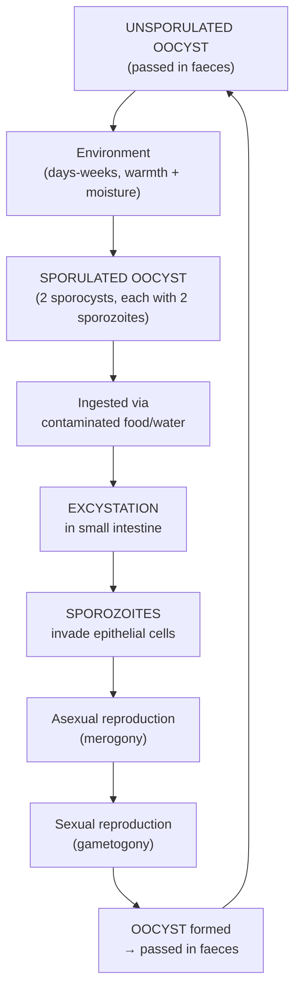

# Lecture 8: Cyclospora and Free-Living Amoebae

## Table of Contents
1. [Learning Objectives](#1-learning-objectives)
2. [Protozoan Parasites -- General](#2-protozoan-parasites--general)
3. [Enteric Parasites](#3-enteric-parasites)
4. [Cyclospora cayetanensis](#4-cyclospora-cayetanensis)
5. [Free-Living Amoebae -- Overview](#5-free-living-amoebae--overview)
6. [Naegleria fowleri](#6-naegleria-fowleri)
7. [Acanthamoeba spp.](#7-acanthamoeba-spp)
8. [Balamuthia mandrillaris](#8-balamuthia-mandrillaris)
9. [Laboratory Diagnosis of FLAs](#9-laboratory-diagnosis-of-flas)
10. [Treatment and Prevention](#10-treatment-and-prevention)
11. [SDL Questions](#11-sdl-questions)
12. [Key Resources](#12-key-resources)

---

## 1. Learning Objectives

- Understand public health relevance of *Cyclospora* and free-living amoebae
- Describe life cycles of these parasites
- Discuss clinical and pathological features of these parasitic diseases
- Describe methods to enable detection to species level
- Discuss treatment and prevention strategies

---

## 2. Protozoan Parasites -- General

- **Protozoa**: unicellular eukaryotes found in a wide range of habitats
- Two morphological forms:

| Form | Description |
|---|---|
| **Trophozoite** | Feeding and reproducing stage; lives within the host |
| **Cyst** | Dormant stage; survives in environment; **infective** to new hosts |

- NIAID Category B -- Hazard Group 3 emerging food/waterborne protozoa:
  - *Cryptosporidium parvum*, *Cyclospora cayetanensis*, *Giardia lamblia*, *Entamoeba histolytica*, *Toxoplasma gondii*, *Naegleria fowleri*, *Balamuthia mandrillaris*

---

## 3. Enteric Parasites

- Parasites that live in the intestines (with or without symptoms)
- **3.5 billion** people affected worldwide; disease in ~450 million (mostly children)
- Public health concern: diarrhoea, anaemia, GI dysfunction, behavioural effects

### Symptoms

- Abdominal pain, diarrhoea, nausea/vomiting
- Gas/bloating, dysentery (blood and mucus in stool)
- Rash/itching around rectum or vulva
- Fatigue, weight loss
- Passing parasites in stool

---

## 4. Cyclospora cayetanensis

### 4.1 Epidemiology

- Worldwide distribution; **endemic in developing areas**; outbreaks in developed countries
- *C. cayetanensis* infects **humans only**
- Contaminated **food and water** are primary sources
- Oocysts survive in environment for months but must **sporulate** to become infective
- **Seasonality**: rainy season (May-August in Honduras)

### 4.2 Clinical Features

- Common enteric pathogen causing **self-limited disease** and asymptomatic carriage
- Clinical manifestations diverse
- **Chronic or persistent diarrhoea** is the most common presenting syndrome

### 4.3 Laboratory Diagnosis

| Method | Details |
|---|---|
| **Modified ZN** (Kinyoun stain) | Microscopic identification of oocysts in stool; **irregular staining** characteristic |
| **Size** | Oocysts **8-10 um** -- approximately **twice the size** of *Cryptosporidium* oocysts |
| **PCR** | Conventional and multiplex PCR-based techniques |

> Key distinction: *Cyclospora* oocysts are ~2x larger than *Cryptosporidium* oocysts and show irregular acid-fast staining

### 4.4 Life Cycle

> **Key**: Oocysts are NOT immediately infective when passed -- they must **sporulate** in the environment (unlike *Cryptosporidium* which is immediately infective)

### 4.5 Treatment

| Regimen | Detail |
|---|---|
| **First-line** | **Trimethoprim-sulfamethoxazole (co-trimoxazole)** 160/800mg BD x 7-10 days |
| **HIV/immunosuppressed** | Longer course (may need secondary prophylaxis) |
| **Sulfa allergy** | No well-established alternative; ciprofloxacin has been tried with limited success |
| **Supportive** | Rehydration (oral or IV) |

### 4.6 Prevention

- High standard of food, water, and personal hygiene (even in high-end resorts)
- **Chlorine/iodine unlikely to kill** *Cyclospora* oocysts
- No vaccine available
- Travellers should:
  - Ensure drinking water is **bottled, boiled, or filtered** (special filter)
  - **Avoid** uncooked berries, unpeeled fruit, salad leaves, fresh herbs (difficult to clean)
  - Ensure food is freshly prepared, thoroughly cooked, and eaten hot

---

## 5. Free-Living Amoebae -- Overview

### 5.1 Key Facts

- **Free-living amoebae (FLAs)**: aerobic, eukaryotic protists comprising several genera
- Infection of humans is **infrequent but often fatal** in both immunocompetent and immunocompromised individuals
- CNS invasion reported in hundreds of patients worldwide

### 5.2 Where Found

| Environment | Examples |
|---|---|
| **Natural water** | Warm lakes, ponds, puddles, ditches |
| **Soil** | Moist soil, mud |
| **Man-made** | Swimming pools, air-conditioning units, humidifiers, dialysis units |
| **Water systems** | Hot water tanks, jacuzzis, water purification filters, eye wash stations |
| **Contact lenses** | Tap water used for cleaning = infection risk |

### 5.3 Species Causing Human Disease

| Species | Disease | Target |
|---|---|---|
| **Naegleria fowleri** | Primary Amoebic Meningoencephalitis (PAM) | Brain |
| **Acanthamoeba** spp. | Granulomatous Amoebic Encephalitis (GAE) + **Keratitis** | Brain + Eyes |
| **Balamuthia mandrillaris** | GAE | Brain |

---

## 6. Naegleria fowleri

### 6.1 Life Cycle and Transmission

1. Swimmer inhales contaminated water
2. **Trophozoites invade nasal mucosa** and replicate
3. Migrate to brain via olfactory nerve
4. Cause **Primary Amoebic Meningoencephalitis (PAM)**
5. **Death within 3-7 days** after symptom onset

> Also: transmission may occur via organ transplantation

### 6.2 Life Cycle -- Three Forms

| Stage | Features | Significance |
|---|---|---|
| **Trophozoite** | 10-35 um; amoeboid; feeds on bacteria | **Infective form**; invades nasal mucosa |
| **Flagellate** | Pear-shaped; 2 flagella; formed when trophozoite enters water | Temporary; non-feeding; reverts to trophozoite |
| **Cyst** | 7-15 um; smooth, round, single wall | Survival form in unfavourable conditions; **NOT found in brain tissue** |

> Unlike *Acanthamoeba*, only the **trophozoite** stage of *Naegleria* is found in clinical specimens (CSF/brain)

### 6.3 Morphology

- Trophozoites: **14-40 um**
- **Uninuclear** with large, prominent nucleoli
- Cytoplasm contains contractile vacuole and numerous vacuoles
- Liu's stain of CSF reveals trophozoites with nuclei and cytoplasmic vacuoles

### 6.3 Pathology

- Extensive **haemorrhage and necrosis** in brain tissue
- Can be visualised with **Haematoxylin and Eosin (H&E) staining** of brain biopsy

---

## 7. Acanthamoeba spp.

### 7.1 Routes of Entry

- Through **cuts/scrapes** on skin
- **Conjunctiva** via abrasions from contact lenses or trauma
- **Inhalation** of contaminated water while swimming
- In immunocompromised: enters circulation and disseminates to brain (GAE) and other organs

### 7.2 Diseases

| Disease | Details |
|---|---|
| **Keratitis** | Contact lens-associated; can result in **loss of eye** (case: 54yo woman, 3 failed cornea transplants) |
| **Granulomatous Amoebic Encephalitis (GAE)** | Rare; almost always fatal; often diagnosed **post-mortem** |

### 7.3 Case Studies

- **Leicester case**: 54-year-old contact lens wearer; 3 cornea transplants failed; loss of eye
- **Portugal case** (Govic et al., 2018): 36-year-old female returning from holiday

### 7.4 Morphology

- Trophozoites with **acantopodia** (characteristic pseudopodia)
- Uninuclear with large nucleoli
- Contractile vacuole and numerous cytoplasmic vacuoles
- On agar culture: **characteristic tracks** visible as amoeba eats through *Klebsiella* spp on agar surface

---

## 8. Balamuthia mandrillaris

| Feature | Detail |
|---|---|
| Disease | **Granulomatous Amoebic Encephalitis (GAE)** -- similar to *Acanthamoeba* GAE |
| Hosts | Immunocompetent AND immunocompromised (unlike *Acanthamoeba* GAE which favours immunocompromised) |
| Transmission | Soil exposure; skin lesions may precede CNS involvement |
| Course | **Subacute to chronic** (weeks to months); headache, seizures, focal neurological deficits |
| Diagnosis | Brain biopsy with immunohistochemistry; **PCR**; will NOT grow on standard *Klebsiella*-seeded agar (requires mammalian cell culture) |
| Treatment | **Combination therapy**: miltefosine + fluconazole + albendazole + others; very few survivors |
| Prognosis | Almost universally fatal; >98% mortality |

---

## 9. Laboratory Diagnosis of FLAs

### 8.1 Sample Types

| Sample | For |
|---|---|
| **CSF** | *Naegleria* -- wet mount for motile trophozoites |
| **Corneal scrapings** | *Acanthamoeba* keratitis |
| **Aqueous/vitreous humour** | Eye infections |
| **Brain biopsy** | GAE (often post-mortem) |
| **Skin biopsy** | Disseminated *Acanthamoeba* |

### 8.2 Methods

| Method | Details |
|---|---|
| **Wet mount microscopy** | Detect motile trophozoites (CSF for *Naegleria*) |
| **Giemsa stain** | Trophozoites with typical morphology in CSF |
| **Liu's stain** | *Naegleria* in CSF |
| **Lactophenol cotton blue** | *Acanthamoeba* cysts |
| **Kop-Color staining** | *Acanthamoeba* cysts |
| **Masson's trichrome** | GAE brain sections |
| **H&E staining** | Brain biopsy for *Naegleria* |
| **Agar culture** | Non-nutrient agar seeded with *Klebsiella*; characteristic tracks |
| **Confocal microscopy** | Corneal imaging |
| **Direct immunofluorescent antibody (DIF)** | Species identification |
| **PCR** | Conventional and **real-time PCR** for *Acanthamoeba*, *N. fowleri*, *B. mandrillaris* |

---

## 10. Treatment and Prevention

### 9.1 Treatment

| Condition | Treatment | Prognosis |
|---|---|---|
| *Acanthamoeba* **keratitis** | Anti-inflammatory drugs | Variable; may lose eye |
| **PAM** (*Naegleria*) | Amphotericin B | Usually **too late**; almost always fatal |
| **GAE** (*Acanthamoeba*) | **No effective treatment** | Poor; diagnosis often post-mortem |

### 9.2 Prevention

| Measure | Detail |
|---|---|
| Avoid warm freshwater swimming | In endemic areas |
| **Never use tap water** for cleaning contact lenses | Major risk factor for *Acanthamoeba* keratitis |
| Chlorinate swimming pools | Regular testing |
| Clean AC systems and dialysis units | Proper maintenance schedules |
| Inspect hot water tanks, jacuzzis, eye wash stations | Periodic cleaning; *Acanthamoeba* can colonise these |

---

## 11. SDL Questions

1. **How do you differentiate *Cyclospora* from *Cryptosporidium* microscopically?** Size (8-10 um vs ~4-5 um) and irregular acid-fast staining pattern of *Cyclospora*
2. **Why is PAM almost always fatal?** Rapid progression (death 3-7 days); diagnosed too late for effective treatment; amphotericin B has limited efficacy
3. **What is the main risk factor for *Acanthamoeba* keratitis?** Contact lens wear with tap water exposure
4. **How is *Acanthamoeba* cultured?** Non-nutrient agar seeded with *Klebsiella* spp; amoebae produce characteristic tracks as they consume bacteria
5. **Why can't chlorine/iodine kill *Cyclospora*?** Oocysts are environmentally hardy and resistant to standard water disinfection

---

## 12. Key Resources

- **CDC DPDx**: http://www.cdc.gov/dpdx/freeLivingAmebic/
- **CDC Cyclosporiasis**: https://www.cdc.gov/parasites/cyclosporiasis/diagnosis.html
- **NIAID Emerging Pathogens**: https://www.niaid.nih.gov/research/emerging-infectious-diseases-pathogens
- **PHE/UKHSA Cyclospora**: https://www.gov.uk/government/news/cyclospora-outbreak-linked-to-mexico
- Govic et al. (2018) *Clinical Microbiology and Infection* -- Acanthamoeba case study
- SMI: Preliminary Identification of Medically Important Bacteria and Fungi (staining methods)
- **YouTube**: Ninja Nerd, Medicosis Perfectionalis, Dr. Matt
- Madigan et al. (2015) *Brock Biology of Microorganisms* (Pearson)
